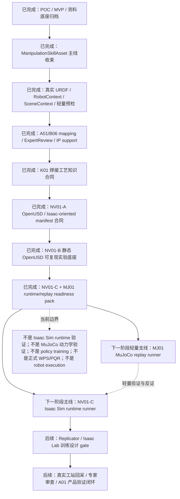

# A02 机器人技能大师焊接技能资产底座

## 项目定位

A02 是公司机器人技能大师能力的焊接技能资产底座项目，目标是把焊接操作中的动作、意图、轨迹、姿态、工艺约束、证据边界、迁移契约和质量反馈沉淀为 `ManipulationSkillAsset`。项目通过仿真、真实机器人日志、人工示教、专家标注和智能焊接工站回采数据，形成可学习、可迁移、可评测、可审计的技能资产，为 A01 智能焊接工站和后续机器人执行验证提供能力底座。

本项目对应公司 MAS 中的 M，也就是机器人技能大师能力。它不是一个独立对外讲述的平台概念，而是公司长期积累机器人操作能力的技术底座。当前第一场景是焊接，后续可以承接打磨、喷涂、切割、装配、检测等工业操作技能。

经过 NVIDIA 物理 AI 技术框架调研，本项目的未来重底座选型调整为：以 OpenUSD 作为数字孪生交换层，以 Isaac Sim 作为默认目标仿真运行时，以 Isaac Lab 作为后续训练闭环目标层。考虑到 Isaac / OpenUSD / Omniverse 技术栈较重，后续同步保留 MuJoCo 作为轻量、学术化、快速动力学验证和反证支线，用于 URDF/MJCF 可加载性、轨迹 replay、接触/运动学假设和小规模策略原型验证。与此同时，`docs/焊接工艺数据库主要参数表.xlsx` 被提升为焊接工艺知识合同源。A02 不重复造通用物理引擎、机器人仿真器、3D 场景标准或训练框架；A02 自己负责焊接技能资产语义、工艺知识合同、证据治理、专家审查和 A01/IP handoff。

## 文件入口

- [README HTML 阅读版](README.html)
- [项目进展记录 HTML 阅读版](details.html)

`README.md` 是项目入口，说明项目定位、当前主链路、核心对象、接口关系、可运行能力、边界和验证方式。

`details.md` 是阶段更新记录，说明每轮完成内容、下一步计划和风险判断。更新根目录 Markdown 时，需要同步刷新对应 HTML 阅读副本。

## 当前主链路

当前主链路是：

```text
SimulationEvidenceBundle / real robot log / human demonstration / H300 workcell run
-> ManipulationSkillAsset
-> SkillTransferAssessment
-> expert review candidate
```

展开到当前默认可运行路径：

```text
SimulationEvidenceBundle
-> ManipulationSkillAsset
+ RobotBodyAsset(URDF)
+ RobotContextSpec
+ SceneContextAsset
+ lightweight RobotFeasibilityResult
-> SkillTransferAssessment
-> ExpertReviewRecord
-> A02->A01 product validation handoff / IP evidence support
-> future OpenUSD / Isaac Sim / Isaac Lab digital twin and training package
```

这条链路的含义是：

- `ManipulationSkillAsset` 是当前 canonical 技能资产本体，描述技能意图、TCP 轨迹、工具姿态、约束、证据来源、质量边界和迁移契约。
- 仿真样本、真实 URDF、robot precheck、modeled task specs 和 1000 next-batch 样本都应写成技能资产 evidence，而不是各自形成平行主线。
- `ready_for_expert_review` 表示资产、机器人上下文、场景上下文和轻量预检足以进入专家审查候选；它不是 `ready_for_robot_execution`。

## 项目粗粒度路线图



当前项目已经完成从“经验结构化 / 仿真样本”到“可审计焊接技能资产 + NVIDIA-native 静态实验底座”的主线收束，并新增 NV01-C + MJ01 readiness pack，把下一阶段真实 Isaac/MuJoCo runner 需要的输入、缺口和边界固化为可复跑 artifact。下一阶段不应直接进入策略训练或真实机器人执行，而应分别实现外部 NV01-C Isaac Sim runtime runner 和 MJ01 MuJoCo replay runner，验证 NV01-B/ready pack 产物能否在真实 runtime 中被打开、绑定和静态/低速 replay。MuJoCo 的结论应作为轻量证据支线和反证来源回写 `ManipulationSkillAsset`，而不是替代 OpenUSD / Isaac 的工站级数字孪生主线。

## 核心对象

- `ManipulationSkillAsset`：技能资产本体，承载意图、运动、约束、证据、质量边界和迁移契约。
- `SkillAssetEvidence`：记录 evidence source、artifact refs、metrics、review status 和 evidence boundary。
- `RobotBodyAsset`：由真实 URDF 和 mesh 解析出的机器人身体资产。
- `RobotContextSpec`：机器人型号、base/TCP/tool/workpiece frame、关节限制来源和真实标定边界。
- `SceneContextAsset`：工件坐标系、焊缝路径、夹具/障碍、安全边界和场景证据边界。
- `RobotFeasibilityResult`：lightweight reachability / collision-assumed / joint-limit / path-continuity / orientation 预检结果。
- `SkillTransferAssessment`：把技能资产、机器人身体、机器人上下文、场景上下文和 feasibility result 汇总成迁移评估。
- `ExpertReviewRecord`：绑定技能资产、机器人上下文、场景上下文、预检结果、人工结论、阻塞原因和下一步动作。
- `WeldProcedureKnowledgeContract`：由焊接工艺参数 Excel 生成的字段合同，记录字段类别、必要性、来源模式、目标对象路径、NV01 用途和证据边界。
- `WeldProcedureParameterSet`：某个技能任务当前已有和缺失的工艺参数集合，区分人填、系统计算、仿真推导、工站回采和资料库引用。
- `WeldProcedureValidationReport`：检查必填、条件必填和补充字段覆盖情况，明确是否阻塞专家审查、仿真 replay 设计或训练设计。
- `A01B06SkillAssetMapping`：把 A01 H300 工站回采和 B06 Physical AI Package 字段映射到 `ManipulationSkillAsset`。
- `A02ToA01ProductValidationHandoff`：A02 反哺 A01 的候选技能包、轨迹候选、姿态/参数建议和失败边界。
- `IPDisclosureSupportMatrix`：把 P0-02、P0-03、P0-04 对应到支撑对象、报告和缺失真实证据。

## 重/轻仿真底座分层路线

当前已完成的路线主题是 **K01 + NV01-A Weld Procedure Knowledge Contract and NVIDIA-Native Digital Twin Foundation**。它把 A02 从“仅能解释技能资产 demo”推进为“能产出由焊接工艺字段合同约束、面向 OpenUSD / Isaac Sim / Isaac Lab 的焊接技能数字孪生与训练准备包”。

推荐的职责边界是：

- OpenUSD：未来统一表达机器人、工件、工装、焊缝、传感器、坐标系、语义标签和工艺 metadata。
- Isaac Sim：未来默认目标仿真运行时，用于机器人导入、replay、传感器仿真、Replicator 合成数据、可达性/碰撞/视野验证。
- Isaac Lab：未来训练闭环目标层，用于 seam tracking、局部位姿修正、受约束策略评估和 sim-to-real 训练设计。
- MuJoCo：作为轻量、学术化和快速迭代的支线，用于 URDF/MJCF 模型加载、关节/接触动力学 sanity check、TCP 轨迹 replay、简化控制原型和 Isaac 重栈前的低成本反证。MuJoCo 不承载最终工站级数字孪生表达，不替代 OpenUSD 场景合同，也不直接输出真实机器人执行结论。
- K01 焊接工艺知识合同：从 Excel 中 47 个字段生成字段定义、必填/条件必填/补充分类、人填/计算/仿真推导/工站回采/资料库引用来源分类、字段覆盖和缺口报告。
- A02：继续以 `ManipulationSkillAsset` 为 canonical truth，负责焊接领域语义、工艺知识合同、证据来源、审查状态、失败边界、专家 gate、A02->A01 handoff 和 IP 支撑。

K01 + NV01-A 第一版不直接安装或运行 Isaac Sim，而是生成可审查的 `weld_procedure_knowledge_contract`、`weld_procedure_parameter_set`、`weld_procedure_validation_report`、`procedure_to_nv01_mapping_matrix`、`WeldSkillDigitalTwinPackage`、`openusd_scene_manifest`、`isaac_sim_replay_config`、`domain_randomization_recipe`、`training_readiness_report` 和 `nvidia_stack_alignment_matrix`。这些 artifact 的目标是把当前 A02 evidence pack 编译成带焊接工艺知识约束的 NVIDIA physical AI 工作流输入合同。

后续路线采用“Isaac 重栈主线 + MuJoCo 轻量支线”的判断：Isaac / OpenUSD 负责工站级场景、传感器、合成数据、复杂可视化和未来 sim-to-real 主验证；MuJoCo 负责更快暴露机器人模型、轨迹、接触和控制假设中的问题。两条路线都必须消费同一个 `ManipulationSkillAsset`、`RobotContextSpec`、`SceneContextAsset` 和 K01 工艺知识合同，并把验证结果写回 evidence / blocking report，避免形成新的平行资产体系。

## A01/B06/A02 接口

`A01 -> A02`：

- 从智能焊接工站的真实或脱敏作业数据生成技能资产 evidence。
- 重点字段包括 task、weld seam、workpiece、path points、robot pose、torch pose、process parameters、manual correction、execution log、anomaly 和 quality result。
- 默认 evidence source type 为 `h300_workcell_run`。

`B06 -> A02`：

- 从 Physical AI Package 读取 task context、coordinate frames、frames、events、labels、trajectory、human correction、metrics、quality labels 和 rerun replay ref。
- B06 不作为本仓库 runtime 依赖；本轮只定义字段合同和报告 artifact。

`A02 -> A01`：

- 输出可供 H300 产品验证或提示的 skill package candidate、trajectory candidate、torch posture suggestion、process parameter hint 和 failure boundary summary。
- 输出不是控制器可下载程序，不是生产派发包，不是 `ready_for_robot_execution`。

`A02 -> IP`：

- P0-02“焊接技能包”由 `ManipulationSkillAsset`、`SkillAssetEvidence`、`ExpertReviewRecord` 和 evidence writeback report 支撑。
- P0-03“焊接轨迹结构化转换”由 `motion.tcp_trajectory`、tool orientation、A01/B06 mapping 和 manual correction 字段支撑。
- P0-04“仿真优先焊接技能数据集”由 `SimulationEvidenceBundle`、modeled task specs、100/500/1000 requested samples 和 evidence source catalog 支撑。

## 当前可运行能力

- 可运行的 `weldcore` 引擎，详见 [weld-experience-engine/README.md](weld-experience-engine/README.md)。
- 从 `SimulationEvidenceBundle` 构建 `ManipulationSkillAsset`，canonical evidence source type 为 `simulation_only`。
- 已从 `docs/焊接工艺数据库主要参数表.xlsx` 生成 K01 工艺知识合同，覆盖 47 个焊接工艺字段、8 个参数类别、21 个必填字段、12 个条件必填字段和 14 个补充字段，并显式标注人填/确认、系统计算、仿真推导和工站回采边界。
- `weldcore.skill_asset.nvidia_digital_twin_report` 默认生成 K01 + NV01-A evidence pack：procedure contract、parameter set、validation report、procedure-to-NV01 mapping、OpenUSD/Isaac-oriented manifest/report、training readiness 和 stack alignment matrix。
- `weldcore.skill_asset.nv01_b_experiment_base_report` 默认生成 NV01-B 可复现实验底座：最小 `openusd_stage.usda`、静态 USD validation report、Isaac replay fixture、K01 参数到仿真参数审计、sensor/annotation manifest、simulation blocking report 和 reproducibility manifest。
- `weldcore.skill_asset.nv01_c_mj01_readiness_report` 默认生成 NV01-C + MJ01 readiness pack：Isaac runtime validation input manifest、MuJoCo lightweight replay feasibility report、runtime/replay blocking report、readiness reproducibility manifest 和 per-task runtime/replay 输入清单。该入口不需要 Isaac Sim、MuJoCo、OpenUSD SDK、GPU、`pxr` 或 `mujoco`；默认状态仍是 `blocked_for_runtime_replay_validation`，不是 Isaac Sim runtime replay、MuJoCo dynamics validation、policy training、正式 WPS/PQR 或真实机器人执行验证。
- 从 `docs/real-urdf/robot.urdf` 解析 `RobotBodyAsset`，当前真实 URDF 可解析为 7 links、6 revolute joints、33 unique mesh files 和 66 mesh references。
- 从 `RobotBodyAsset` 构建 nominal `RobotContextSpec`，保留 `nominal_from_asset_not_calibrated`、`not_tcp_calibrated`、`not_vendor_validated` 和 `not_ready_for_robot_execution` 边界。
- 构建默认 `SceneContextAsset`，表达工件坐标系、焊缝路径、安全边界和夹具/障碍占位。
- 构建 lightweight `RobotFeasibilityResult`，当前只做结构性 reachability、collision assumed、joint-limit source、path continuity 和 orientation 预检。
- `SkillTransferAssessment` 在默认上下文齐备时推进到 `ready_for_expert_review`。
- `ExpertReviewRecord` 记录四项从 nominal context 走向真实上下文的必填项：真实 TCP 标定、工件坐标系测量、机器人型号身份确认和关节限制来源确认。
- `SkillAssetEvidenceWritebackSummary` 把 8 个 modeled task specs 和 1000 next-batch samples 记录为技能资产 evidence candidates。
- `weldcore.skill_asset.asset_report` 默认生成 12 份 JSON artifact，服务 A01 产品验证和 IP 交底准备。

## 下一阶段任务

下一阶段建议以 NV01-C Isaac Sim Runtime Import and Static Replay Validation 为主线，同时启动 MJ01 MuJoCo Lightweight Replay Feasibility 作为轻量支线。任务粒度保持在 runtime / replay gate，不进入训练或真机执行：

1. 准备并记录 Isaac Sim runtime 环境、版本、启动方式和失败边界。
2. 导入 NV01-B `openusd_stage.usda` 与 replay fixture，验证 `/World`、robot、workpiece、weld task、seam path、TCP trajectory candidate、sensor placeholder 和 safety boundary prim 可加载。
3. 做静态或低速 trajectory replay，输出 runtime validation report，明确 stage import、frame binding、trajectory binding、procedure metadata 和 sensor placeholder 的通过/阻塞项。
4. 并行做 MJ01：从当前真实 URDF / nominal robot context 生成或校验 MuJoCo 可消费的 URDF/MJCF 最小模型，验证关节、mesh、TCP frame、简化工件/焊缝和 TCP 轨迹 replay 是否可运行。
5. 自动汇总仍阻塞真实 replay 的输入：robot USD/articulation、MJCF/URDF 模型质量、TCP/tool/workpiece 标定、最小 sensor layout、H300 工站日志、电流/电压/热输入、工艺人员确认和专家审查结论。
6. 继续把 Isaac Lab policy training、Replicator dataset、MuJoCo 策略训练、真实碰撞验证、真实焊接质量验证和 robot execution 留到后续 evidence gate。

## 边界

- 当前不宣称真实机器人可执行。
- 当前不宣称真实焊接质量验证。
- 当前不宣称正式 WPS/PQR。
- 当前不把 Excel 字段表、K01 参数集或系统计算结果写成正式 WPS/PQR。
- 当前确认 OpenUSD / Isaac Sim / Isaac Lab 是未来真实仿真训练闭环的主底座方向，MuJoCo 是轻量验证和反证支线；NV01-B 已写出静态 `openusd_stage.usda` 原型和 validation gate，但仍是 `not_isaac_sim_runtime_validation` 和 `not_mujoco_dynamics_validation`，不宣称已经完成 Isaac Sim runtime replay、MuJoCo 动力学验证、Isaac Lab 训练或真实 sim-to-real 验证。
- `ready_for_expert_review` 不是 `ready_for_robot_execution`。
- `RobotFeasibilityResult` 不是完整 IK solver，不是真实 collision validation，不是真机日志验证。
- MuJoCo、ManiSkill/SAPIEN、Gazebo/MoveIt 和其他 robot adapter 可作为同一技能资产主线下的 evidence source、历史支撑或对照反证来源；其中 MuJoCo 优先作为下一阶段轻量支线，其他 adapter 暂不作为未来主底座的平行默认候选。

## 验证命令

默认验证路径：

```bash
cd weld-experience-engine
uv sync --extra dev --extra viz
uv run pytest -q
```

默认技能资产报告入口：

```bash
uv run python -m weldcore.skill_asset.asset_report \
  --outdir artifacts/skill-assets/canonical
```

该命令生成 12 份 JSON：

- `skill_asset_report.json`
- `robot_body_asset_report.json`
- `robot_context_spec.json`
- `scene_context_asset_report.json`
- `skill_transfer_assessment.json`
- `robot_feasibility_result.json`
- `skill_asset_evidence_writeback_summary.json`
- `skill_asset_evidence_source_catalog.json`
- `a01_b06_skill_asset_mapping.json`
- `expert_review_record.json`
- `a02_to_a01_product_validation_handoff.json`
- `ip_disclosure_support_matrix.json`

默认结果中，`transfer_assessment.status` 为 `ready_for_expert_review`，`expert_review_record.review_status` 为 `pending_expert_review`，`robot_feasibility_result.status` 为 `passed`，但 evidence boundary 仍包含 `not_ready_for_robot_execution`、`not_full_ik_solver`、`not_collision_validated` 和相关真实上下文缺口。

## 默认 Demo Evidence Pack

默认 Demo Evidence Pack 入口：

```bash
cd weld-experience-engine
uv run python -m weldcore.skill_asset.demo_report \
  --outdir artifacts/demo/skill-asset-evidence
```

该命令运行 2 个默认仿真任务。每个任务目录输出 12 份 canonical artifact 原始文件名和 1 份 `simulation_evidence_bundle.json`；顶层输出 `demo_summary.md`、`demo_summary.json` 和 `demo_summary.html`。

该 evidence pack 用来把 `ManipulationSkillAsset`、仿真证据、A02->A01 handoff、专家审查候选和 IP support matrix 放在同一组可审查材料里。默认状态是 `ready_for_expert_review` evidence pack / `ready_for_expert_review_candidate_pack`，边界仍是 `not_ready_for_robot_execution`、`simulation_only`、`not_full_ik_solver`、`not_real_collision_validation` 和 `not_real_welding_quality_validation`；它不是控制器可下载程序，不是生产派发包，也不是真实机器人执行结论。

## K01 + NV01-A 当前输出入口

K01 + NV01-A 默认 report 入口：

```bash
cd weld-experience-engine
uv run python -m weldcore.skill_asset.nvidia_digital_twin_report \
  --outdir artifacts/demo/nvidia-digital-twin-foundation
```

预期输出包括：

- `nv01_summary.md/json`
- `weld_procedure_knowledge_contract.json`
- `weld_procedure_parameter_set.json`
- `weld_procedure_validation_report.json`
- `procedure_to_nv01_mapping_matrix.json`
- `weld_skill_digital_twin_package.json`
- `openusd_scene_manifest.json`
- `isaac_sim_replay_config.json`
- `domain_randomization_recipe.json`
- `training_readiness_report.json`
- `nvidia_stack_alignment_matrix.json`

这些 artifact 的第一版目标是 `ready_for_procedure_contract_review`、`ready_for_simulation_replay_package_design`、`ready_for_training_design_review` 和 `not_ready_for_policy_training`。它们是面向工艺/专家审查和 OpenUSD/Isaac 的输入合同，不是正式 WPS/PQR，也不是已完成的 Isaac Sim runtime、policy training 或 robot execution 结果。

## NV01-B 可复现实验底座

NV01-B 默认 report 入口：

```bash
cd weld-experience-engine
uv run python -m weldcore.skill_asset.nv01_b_experiment_base_report \
  --outdir artifacts/demo/nv01-b-experiment-base
```

预期输出包括最小 `openusd_stage.usda`、静态 USD validation report、Isaac replay fixture、procedure simulation parameter audit、sensor annotation manifest、simulation blocking report、reproducibility manifest 和 `_source_nv01a/` 源 artifact。该命令不需要 Isaac Sim、OpenUSD SDK、GPU 或 `pxr`；默认状态仍保留 `blocked_for_real_isaac_sim_replay` 和 `not_isaac_sim_runtime_validation`，不是 Isaac Sim runtime replay、policy training、正式 WPS/PQR 或真实机器人执行验证。

## NV01-C + MJ01 Readiness Pack

默认入口：

```bash
cd weld-experience-engine
uv run python -m weldcore.skill_asset.nv01_c_mj01_readiness_report \
  --outdir artifacts/demo/nv01-c-mj01-readiness-pack
```

预期输出包括 `isaac_runtime_validation_input_manifest.json`、`mujoco_lightweight_replay_feasibility_report.json`、`runtime_replay_blocking_report.json`、`readiness_reproducibility_manifest.json` 和 per-task runtime/replay 输入清单。该命令默认自举 `_source_nv01b/`，不运行 Isaac Sim 或 MuJoCo；默认边界包含 `not_isaac_sim_runtime_validation`、`not_mujoco_dynamics_validation`、`not_policy_training_result`、`not_formal_WPS_PQR` 和 `not_ready_for_robot_execution`。

## 历史能力索引

以下能力仍可作为 evidence source、历史支撑或反证来源，不再作为默认项目主线：

- 经验结构化 POC、技能迁移 MVP、资料底座 gate、`SyntheticSkillDataset v2` 输入规范 gate 和仿真输出接入 gate。
- `SkillDataset`、`WeldSkillPackage`、`WeldSkillUnit`、迁移评测和旧 evidence 输出结构。
- simlite/mock bundle 作为 L0 稳定仿真和测试基线。
- ManiSkill/SAPIEN 小批量默认仿真入口、Phase 1 accumulation、Phase 2 sharded accumulation、1000 requested samples next-batch。
- 批量焊接任务建模与验证闭环，默认 8 个 modeled task specs。
- Gazebo/MoveIt 候选路线失败边界记录。
- 从 `SimulationEvidenceBundle` 到 `RobotProcessPackageDraft` 的机器人候选草案转换。
- Rerun 证据回放兼容处理。
- 焊接工艺参数 Excel 表格；它已被提升为 K01 工艺知识合同源，但仍不是正式 WPS/PQR。
- 前期 POC、MVP、gate、白皮书和旧计划材料，统一保留在 `docs/archive/`。

## 当前目录结构

```text
.
├── README.md
├── README.html
├── details.md
├── details.html
├── docs/
│   ├── strategy/
│   ├── architecture/
│   ├── skill-assets/
│   ├── simulation/
│   ├── evidence/
│   ├── real-urdf/
│   ├── archive/
│   ├── 焊接工艺数据库主要参数表.xlsx
│   └── superpowers/
└── weld-experience-engine/
    ├── README.md
    ├── pyproject.toml
    ├── tests/
    └── weldcore/
```

## Agent 维护规则

后续推进本项目时，应先判断是否需要同步更新 [details.md](details.md)。

需要更新 `details.md` 的情况包括：

- 项目阶段、范围或默认主线发生变化。
- `ManipulationSkillAsset`、A01/B06 mapping、专家审查、IP 支撑矩阵、仿真路线、证据边界或 adapter 边界发生变化。
- 新增或移除重要基础能力、报告命令、验证路径或交付物。
- 下一步计划、风险判断或阶段优先级发生变化。
- 真实焊接质量验证、WPS/PQR、最终仿真器选择等边界判断发生变化。

更新入口文档、阶段说明或路线说明时，必须同步刷新同目录 HTML 阅读版。尤其是根目录 `README.md` 和 `details.md`：Markdown 是维护源，HTML 是面向项目负责人、业务人员、工艺人员和非技术读者的阅读副本。
