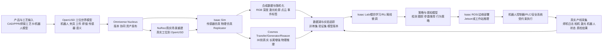

# 英伟达物理AI技术框架与焊接机器人专用大脑方案研究报告

## 执行摘要

NVIDIA 在“物理 AI”方向上的技术栈并不是单一产品，而是一个分层体系：**Omniverse**更像开发工业数字孪生与物理 AI 应用的底座平台；**OpenUSD**是跨工具、跨团队、跨阶段的数据表示与互操作内核；**Isaac Sim**是建立在 Omniverse 之上的机器人高保真仿真与合成数据参考框架；**Cosmos**则是面向物理 AI 的世界模型、数据增强与推理能力层。把它们放在同一张架构图里看，最合理的理解是：OpenUSD 负责“统一世界表示”，Omniverse 负责“构建、协同与部署”，Isaac Sim 负责“机器人仿真、传感器与训练数据”，Cosmos 负责“从 3D/仿真到更大规模、更真实、更具长尾覆盖的数据与世界推理”。citeturn22view2turn22view3turn23view2turn28view1turn22view1

对于“训练焊接机器人专用大脑”这一目标，本报告的核心结论是：**不要把 Cosmos 看成 Isaac Sim 的替代品，也不要把 OpenUSD 看成仅仅是文件格式**。工程上更优的路线是，以 OpenUSD 为统一数据底板，以 Omniverse/Nucleus 为协同与资产中枢，以 Isaac Sim/Isaac Lab 构建焊接工位、传感器、工艺扰动与策略训练闭环，再用 Cosmos Transfer/Reason/Generator 扩展长尾场景、增强视觉真实性、补齐危险工况和稀有缺陷样本。部署时则应让**机器人 OEM 控制器/PLC/安全回路继续承担硬实时与功能安全职责**，AI 模型主要输出受约束的焊缝跟踪修正、策略切换、工艺参数建议或局部动作增量，而不是直接越过安全系统闭环驱动整台焊接工作站。citeturn23view2turn22view3turn28view1turn27view4turn30view5turn19search14turn19search1

如果目标是中短期内做出可落地的工业样机，那么推荐路线不是“先追求通用机器人大模型”，而是**先做焊接专用具身策略与工艺知识系统**：先实现多传感器焊缝识别、焊枪位姿与焊接参数的闭环控制，再逐步叠加跨工件、跨夹具、跨材料和跨工艺的泛化能力。对于这一类接触丰富、热过程敏感、质量标准严格的任务，训练体系必须把**工艺配方、轨迹几何、焊缝质量标准、域随机化、真实回放校准和上机安全验证**一起设计，而不能只做“仿真里成功插值”。citeturn12search0turn16search3turn17search9turn18search5turn14search8turn14search5turn14search2

下文在未指定预算与团队规模的前提下，做如下明确假设：**场景以工业六轴机械臂焊接单元为主，优先面向弧焊流程（GMAW/MIG/MAG 一类），单元包含焊机、电源、送丝、夹具、工件定位、视觉/激光传感器、安全围栏与抽排烟系统**。若实际项目是激光焊、TIG、协作机器人共享工位或多机器人变位机联动，报告中的参数化方式、质量标准与安全边界需要相应调整。对“数据比例”“工作量”“算力配置”等未被官方文档直接给出之处，本文均以**工程推断**明确标注。citeturn14search8turn14search3turn19search14turn19search1turn19search6

## Omniverse

**目标与定位。** NVIDIA 官方当前将 Omniverse定位为“用于开发工业数字孪生和机器人仿真等物理 AI 应用的库和微服务集合”；在文档中心中，它被描述为“用于开发 physical AI simulation applications and agentic workflows 的 accelerated libraries and microservices”。这意味着 Omniverse 的核心价值已经从过去的“统一 3D 协作平台”进一步演进为“OpenUSD 应用、服务、协同、流送与部署底座”。citeturn32search1turn22view2

**核心组件与架构。** 从开发者视角看，Omniverse 平台主要分成三层：其一是 **OpenUSD Data Exchange**，包括 Enterprise Nucleus Server、OpenUSD Exchange SDK、OpenUSD Connections；其二是 **Building OpenUSD Applications**，即基于 Kit SDK 与相关 API/服务构建应用；其三是 **Content Streaming and Deployment**，即自建部署、云部署、WebRTC 流送与托管式运行。Kit 本身又把 USD/Hydra、Omniverse Client Library、Carbonite、RTX Renderer、脚本与 `omni.ui` 聚合在一起，形成可扩展的应用框架。对于高性能场景访问，Omniverse 还提供 Fabric/USDRT 路径，以减轻每帧遍历 USD 场景图的负担，并在 CPU/GPU 与网络客户端之间高效传递场景数据。citeturn22view3turn22view4turn24view4turn25view3

**安装与使用流程。** 2025 年 10 月 1 日起，Omniverse Launcher 已被弃用，NVIDIA 明确建议开发者直接通过 GitHub、NGC 与文档入口获取 SDK、API 与服务；这对企业项目非常重要，因为“安装 Omniverse”现在更准确地说是“选择 Kit SDK/API/服务/Nucleus 的组合”。常见起步方式有三种：本地或虚拟工作站上使用 Kit SDK；通过服务 API 将 OpenUSD/RTX 能力嵌入现有系统；使用 Kit Application Streaming/WebRTC 在浏览器中流送 OpenUSD 应用。开发语言以 **Python 与 C++** 为主，Kit 扩展生态同样围绕这两种语言展开。citeturn24view5turn22view2turn24view4turn22view4

**主要功能与能力。** 在用户需求映射上，Omniverse 的强项不是“替代某个单点工具”，而是把高保真渲染、OpenUSD 场景处理、协同编辑、文件/对象访问、搜索、代码生成与部署拼接成真实生产工作流。渲染侧依赖 RTX、Hydra 与相关材质/渲染扩展；协同侧依赖 Nucleus 提供的实时交换和“single source of truth”；资产侧可通过 OpenUSD Connections/Exchange SDK 与第三方 DCC/CAD/仿真软件打通；插件侧则以 Kit 扩展为主，适合企业把自己的 UI、流程、审校、搜索、资产规约、服务逻辑嵌入进去。citeturn22view2turn22view3turn22view4turn24view4

**数据格式与互操作性。** 在 Omniverse 体系里，OpenUSD 不是附属功能，而是平台的主要数据交换语言。官方文档把 Nucleus 定义为支持 OpenUSD 实时交换的数据库与协作引擎；OpenUSD Exchange SDK 则帮助开发者把原生数据映射到“OpenUSD-legible data models”；Connections 则处理导入、导出、转换、文件格式插件等外围互联。因此，对企业来说，Omniverse 最关键的设计原则不是“所有数据都只存一个 `.usd` 文件”，而是“以 OpenUSD 定义世界与资产结构，再围绕它组织协同、连接与服务”。citeturn22view3turn23view5turn33view0

**性能与扩展性。** Omniverse 的扩展性主要体现在两侧：一侧是应用/服务开发，另一侧是协同/流送/云部署。Services 框架官方说明可在单机、服务器、虚拟机、云与 Kubernetes 上部署；Kit Streaming 文档则支持把应用流送到浏览器。Nucleus 企业版本的 sizing guide 给出了生产环境参考：支持约 500 并发用户、每会话约 8–30 个 Live Edit 用户，推荐低时延连接与 NVMe 存储，最低硬件建议为 16 核 CPU、32GB 内存、500GB 存储。对大型工业项目，这意味着 Omniverse 完全可以进入企业基础设施规划，而不仅是研发团队桌面软件。citeturn24view3turn24view4turn24view2

**典型应用场景与案例。** NVIDIA 官方把 Omniverse 的重点用例放在工业设施数字孪生、机器人仿真、机器人学习、合成数据生成与辅助驾驶仿真上；中国站页面还明确把 Cosmos 与 Omniverse 联合用于更大规模的数据集扩展。客户案例中，Foxconn 使用 Omniverse 库和微服务构建与运行智能工厂数字孪生；工业设施数字孪生用例页强调可在虚拟环境中设计、仿真、运营和优化真实资产与流程。对于焊接机器人项目，这意味着 Omniverse 最自然的角色不是“训练器”，而是**焊装车间与工位数字孪生的母平台**。citeturn33view1turn11search8turn11search0

**优点、缺点与限制。** Omniverse 的优点是体系完整：有 OpenUSD 底板、有协同中枢、有渲染、有服务化部署路径，也有与机器人仿真和世界模型结合的官方路线。缺点是它本身并不自动等于“工业应用成品”：团队仍然需要自己设计领域 schema、数据规范、权限与发布流程、算力与流送体系。另外，Launcher 退场后，平台更偏“开发者优先”，这对工程能力强的团队是优势，对只期待开箱即用 GUI 的团队则提高了入门门槛。citeturn24view5turn22view2turn24view4

**官方资源与重要参考。** Omniverse 官方资料建议优先看：Docs Hub 与 Developer Overview，用于理解平台分层；Kit Manual，用于扩展开发；Services 与 Kit Streaming 文档，用于云化/服务化；Nucleus 文档，用于协同与容量规划；中国站 Omniverse 页面与相关技术博客，用于快速把握物理 AI 定位和机器人场景。citeturn22view2turn22view3turn22view4turn24view3turn24view4turn24view2turn32search1turn33view2

## OpenUSD

**目标与定位。** OpenUSD 的官方定义是“用于可扩展、分层组织的静态与时间采样数据编码的系统”，其主要目的在于在多个协作工具之间交换、增强并组合数据。它既是开放的场景描述框架，也是一个由多层文件、引用、变体和组合弧驱动的高性能场景图系统；官方 FAQ 明确强调：**USD 不是“又一个文件格式”这么简单**。citeturn23view2turn23view0

**核心组件与架构。** OpenUSD 的最核心概念包括 **Layer、Stage、Prim、Attribute、Relationship、Schema、Composition Arcs**。数据组织在分层 Layer 中，组合后形成 Stage；Prim 作为树状层级里的基本单元，承载属性、关系与元数据；高层语义通过 schema 赋义，例如 `UsdGeom`、`UsdShade` 等。OpenUSD 的强大之处在于可以把几何、材质、灯光、动画、绑定、甚至物理语义统一编码到组合场景中，同时保持大规模资产引用、覆写、变体切换与非破坏性编辑能力。citeturn23view0turn23view2

**安装与使用流程。** 对纯 OpenUSD 而言，官方主页提供“Get and Build”入口，OpenUSD 由一组 **C++ 库与 Python 绑定**构成；教程与工具链普遍依赖 Python 绑定。标准工具集包括 `usdview`、`usdcat`、`usddiff`、`usdzip` 等，其中 `usdview` 是最完整的可视化和诊断工具。若项目重点是“把企业自有数据快速接入 USD 工作流”，而不是自己从源码深度构建运行时，那么 NVIDIA 的 **OpenUSD Exchange SDK** 是更现实的工程入口：它支持 Python wheel 安装，可直接在虚拟环境里安装，并提供更高层的 stage authoring 辅助函数。citeturn9search2turn23view2turn23view3turn23view4turn23view5

**主要功能与能力。** OpenUSD 本身不以“渲染器”或“物理引擎”定位，但它通过标准 schema 与插件机制，把渲染、材质、几何、层级、时间、物理与其他领域语义统一到一个可组合模型里。Hydra 是其重要渲染抽象，允许把 USD 内容送往不同 renderer；OpenUSD 的 schema 集合则负责承载网格、材质、灯光、绑定和物理等信息。对协同来说，OpenUSD 最大的价值在于“把大场景拆开、再组合回去”，让团队按资产、工位、工序、发布阶段与变体进行分工，而不是在一个巨大文件里串行工作。citeturn22view4turn23view0turn23view2

**数据格式与互操作性。** 如果说 Omniverse 是“平台层互操作”，那么 OpenUSD 是“数据层互操作”。NVIDIA 中文博客对 OpenUSD 的表述很直接：它不会取代已有工具和数据格式，而是提供一种通用方法来表示网格、PBR 材质等 3D 概念，并随着生态演进支持 physics、B-reps 等更多域；导入/导出器、转换器和 USD 文件格式插件共同构成接入路径。对焊接项目而言，OpenUSD 最重要的角色不是“存 3D 模型”，而是统一表示 **机器人、夹具、工件、焊缝、传感器、材质、语义标签、物理属性、变体与工艺上下文** 的世界模型。citeturn33view0turn23view2

**性能与扩展性。** OpenUSD 官方性能文档给出了非常具体的工程建议：大型场景优先使用二进制 `usdc`/crate 文件；使用 payload 组织大资产，从而以“未加载”方式快速打开 Stage，只在需要时加载细节；控制 layer 数量与 prim 数量；在更高粒度使用 instancing；在多线程加载中合理处理内存分配器。官方文档甚至指出，在 Pixar 的 Linux 经验中，针对多线程加载使用更适合的 allocator 可显著改善 `UsdStage` 加载与 Hydra 成像性能。对工业数字孪生和焊接产线场景，这类建议不是学术细节，而是决定“工位合不合得动、审不审得动、能不能多人联编”的基础规则。citeturn25view2turn25view0turn25view1

**典型应用场景与案例。** 官方 FAQ 与 Omniverse USD 文档都指出，OpenUSD 已用于电影、动画、游戏、AECO 与数字孪生等领域。对于机器人与工业现场，OpenUSD 的价值尤为突出，因为它天然适合表达“多来源资产 + 多层次装配 + 多版本发布 + 多角色协作”的场景。NVIDIA 2025 年中国博客还强调，OpenUSD 是物理 AI 工作流的基础技术，并把机器人开发、自动驾驶与工业系统作为主要受益对象。citeturn7search22turn33view2

**优点、缺点与限制。** OpenUSD 的最大优点是中立、开放、可组合、可扩展。最大限制则是：**它解决的是表示与组合问题，不直接解决仿真真实性、渲染速度、训练方法和控制闭环问题**。如果团队把 OpenUSD 误当成“拿来即用的模拟器”，会走偏；如果把它当成统一世界模型与数据总线，再叠加 Omniverse、Isaac Sim、Cosmos 等上层能力，它的价值才会完全释放。citeturn23view2turn23view0

**官方资源与重要参考。** OpenUSD 官方优先阅读顺序建议为：Introduction/Overview、Terms and Concepts、FAQ、Toolset、Performance 文档；如果项目重点是企业接入与资产交换，再补充 OpenUSD Exchange SDK 的 Getting Started 与 Authoring USD Data。citeturn23view0turn23view1turn23view2turn23view3turn25view2turn23view4turn23view5

## Isaac Sim

**目标与定位。** Isaac Sim 官方将其定义为“基于 NVIDIA Omniverse 的参考应用”，用于在物理真实的虚拟环境中开发、仿真、测试与训练 AI 驱动机器人。中国站页面进一步强调，它是**开源参考框架**，可用于机器人仿真、测试与合成数据生成，并可基于 OpenUSD 构建自定义模拟器，或嵌入既有测试验证流水线。citeturn28view1turn31search2turn32search4

**核心组件与架构。** Isaac Sim 以 Omniverse Kit 为底座，以 OpenUSD 作为统一数据交换格式，在此之上叠加高保真 GPU PhysX、RTX 传感器渲染、机器人导入/装配、Replicator 合成数据、ROS 2 Bridge、OmniGraph/Action Graph 等能力。老版本文档明确写到它支持从 Onshape、URDF、MJCF 等格式导入机械系统；系统架构页说明平台同时支持 C++ 与 Python API，并与 ROS/ROS 2、Jupyter、VS Code 等开发流兼容。当前官方首页还指出，Isaac Sim 可使用 **PhysX 或 Newton**，并能加入 RTX 与基于物理的传感器，为 Isaac Lab 做准备并通过 ROS 2 验证机器人栈。citeturn28view1turn28view2turn31search13turn11search5

**安装与使用流程。** 现行安装文档显示，Isaac Sim 可在 **Windows/Linux** 上使用，支持工作站、容器、云、livestream 与 Python 环境等多种安装方式。对研发团队而言，最常见的两条路径是：其一，使用完整工作站/容器版本做交互式场景开发；其二，使用 **Python 环境安装**，在虚拟环境或 Notebook 中按包组合应用。Python 环境安装页目前要求 Python 3.11，并提供 `isaacsim`、`isaacsim-core`、`isaacsim-replicator`、`isaacsim-ros2`、`isaacsim-sensor` 等拆分包。需要注意的是，近两年 Isaac Sim 发布节奏较快，文档中同时存在 5.1 与 6.0 分支入口；实际项目务必锁定单一版本线，并让仿真、训练、部署、资产与桥接依赖全部对齐。citeturn22view5turn26view4turn27view1

**主要功能与能力。** Isaac Sim 最适合承担五类工作：一是导入与调优机器人及其机械参数；二是构建数字孪生环境；三是模拟相机、LiDAR、接触等多模态传感器；四是用 Replicator 构建合成数据与域随机化管线；五是为 Isaac Lab、ROS 2、SIL/HIL、策略部署提供仿真闭环。官方文档直接将 Replicator 定义为合成数据工具集，覆盖 domain randomization、sensor simulation、annotators 与 writers；随机化文档还明确支持用 USD 和 Isaac Sim API 写自定义随机化逻辑。citeturn28view1turn27view2turn26view5

**协同、资产管理与插件生态。** Isaac Sim 的资产与场景管理并不是孤立系统，而是沿用 Omniverse/OpenUSD 机制：它可以与 Nucleus、Omniverse Connectors、Asset Browser、SimReady 资产和 NuRec 重建环境协同工作。中国站教程还展示了用 NuRec 把真实传感器数据重建为 OpenUSD 场景并导入 Isaac Sim，再叠加 SimReady 资产生成合成数据或训练环境。插件生态方面，Isaac Sim 本身就是一组扩展集合，Python 包页也显示了 core、sensor、replicator、robot、ros2、benchmark 等模块化拆分。citeturn10search0turn33view3turn26view4

**数据格式与互操作性。** OpenUSD 在 Isaac Sim 中不是外围支持，而是核心数据格式。官方“什么是 Isaac Sim”页面明确写道：USD 是 Isaac Sim 核心的数据互换格式，机器人、场景、资产与语义都围绕它组织。中国站则强调 Isaac Sim 具备基于 OpenUSD 的可扩展性。对于焊接项目，这非常关键，因为焊接工位往往需要同时管理 CAD/机器人模型、夹具、工件、工艺版本、相机标定与传感器位姿。通过 USD，把这些要素放在同一“世界”中，后续的仿真、采集、训练与部署才能连起来。citeturn28view2turn31search2

**性能与扩展性。** Isaac Sim 的性能优势主要来自 GPU 加速物理与传感器渲染、头less/容器化运行能力，以及与 Isaac Lab 的向量化训练联动。文档说明其核心仿真是“high fidelity GPU based PhysX engine”，并支持工业规模的多传感器 RTX 渲染。安装页则表明其天然适合工作站、容器和云。另一方面，Release Notes 显示从 5.0 起代码库以 Apache 2.0 许可证开源，并持续加强轻量级 headless 应用、随机化依赖管理、并行 I/O 等数据生成性能改进。citeturn28view1turn22view5turn27view1

**典型应用场景与案例。** 官方与博客材料把 Isaac Sim 用在机器人数字孪生、合成数据、SIL/HIL、群体机器人测试和 sim-to-real。最有参考价值的工业例子是 Isaac Lab + Isaac ROS 的 **UR10e 齿轮装配零样本 sim-to-real 转移**：策略在 Isaac Lab 中训练，在真实机器人上通过 Isaac ROS 和低级力矩接口部署。虽然装配不等于焊接，但它与焊接共享“接触丰富、位姿精度高、现实适配困难”的难点，因此在工程方法上具有很强借鉴性。citeturn34view3turn26view6

**优点、缺点与限制。** Isaac Sim 的优点是“机器人导向”非常明确：仿真、传感器、域随机化、ROS 2、合成数据、训练与部署路径都在同一个官方体系内。限制主要有三点：第一，它不是焊接工艺专用模拟器，热输入、熔池、飞溅、烟尘、电弧等现象的真实建模仍需项目级近似与校准；第二，版本迭代较快，企业项目必须做严格依赖冻结；第三，真实部署成功与否很大程度取决于**输入一致性、系统响应一致性、执行器/摩擦/延迟建模**，而不只是“仿真里学到一个 PPO 策略”。citeturn27view4turn27view1turn22view5

**官方资源与重要参考。** Isaac Sim 优先资料应包括：安装文档、What Is Isaac Sim、Python Environment Installation、Replicator 文档、Randomization Snippets、ROS 2 Bridge/API，以及 Isaac Lab 的 Sim2Real Deployment 与 Gear Assembly 教程。中文读者还可以补充中国站 Isaac Sim 页面和相关博客。citeturn22view5turn28view1turn26view4turn27view2turn26view5turn26view2turn26view6turn27view4turn32search4turn31search7

## Cosmos

**目标与定位。** Cosmos 官方 GitHub 仓库把它定义为“面向世界模型、数据集与工具的开放平台”，服务对象包括机器人、自动驾驶、智能基础设施等物理 AI 场景。2025 年的平台论文把 Cosmos 表述为帮助开发者构建“customized world models”的世界基础模型平台；2026 年 6 月发布的 Cosmos 3 则进一步上升为“omnimodal world models for Physical AI”。citeturn21view4turn16search2turn29view0

**核心组件与架构。** 当前最值得关注的是 **Cosmos 3**。官方仓库说明它采用统一的 **Mixture-of-Transformers** 架构，联合处理与生成语言、图像、视频、音频和动作序列，并暴露两个运行面：**Reasoner** 与 **Generator**。Reasoner 接收文本和视觉输入，输出文本，用于世界理解、 grounding、物理推理、任务规划、动作预测等；Generator 接收文本、视觉、声音与动作，输出视觉、声音和动作，用于世界生成、世界仿真、未来预测、合成数据和策略学习。中文官方博客进一步把它解释为“推理塔 + 生成器塔”的双塔结构。citeturn22view1turn29view2

**安装与使用流程。** Cosmos 的使用路径比传统机器人框架更“AI 化”。研发阶段，官方推荐 **Diffusers/Transformers** 进行 Python-first 开发；服务阶段，可用 **vLLM-Omni、vLLM** 和 **NIM** 提供 OpenAI-compatible 端点；模型与代码主要通过 GitHub、Hugging Face、NGC/NIM 获取。中文官方博客显示，Cosmos 3 Nano 与 Super checkpoints 已可获取，而 Reasoner NIM 可通过预构建容器快速拉起生产级推理服务。整体上，它的主语言生态是 **Python**，但服务接口可以被任意语言调用。citeturn22view1turn30view4turn30view0turn30view1

**主要功能与能力。** Cosmos 的价值不在传统意义的“渲染器、物理引擎或 CAD/资产管理平台”，而在**世界理解、世界生成、长尾数据扩展、行动建模与推理服务化**。官方仓库列出的关键能力包括：物理合理性分析、时间事件理解、空间 grounding、因果结果推断、动作建模、未来 rollouts、图像/视频/声音/动作生成等。对于物理 AI 项目，它更像“在仿真与真实之间、在多模态观测与未来状态之间工作”的模型层。citeturn22view1

**数据格式与互操作性。** Cosmos 与 OpenUSD 的关系不是“替代”，而是“叠加”。NVIDIA 2026 年博客明确了一个重要路线：**用 Omniverse 在 OpenUSD 上生成 ground-truth simulation，再交给 Cosmos Transfer 做 photoreal transformation 与大规模环境变化增强**。也就是说，OpenUSD/Omniverse 管“结构正确、物理标注清晰的 3D 世界”，Cosmos 管“更真实、更多样、更覆盖长尾的视频与世界状态”。这对焊接项目尤其重要，因为真实工厂中的眩光、烟尘、遮挡、污染、部件反光和罕见失效很难完全手工建模，但可借助世界模型扩展。citeturn30view5turn33view1

**性能与扩展性。** Cosmos 仓库在生态层面给出了三个关键外围：**Cosmos Framework** 用于训练与服务工作流，**Cosmos Curator** 用于分布式物理 AI 数据清洗、注释、过滤与去重，**Cosmos Evaluator** 用于自动评测 world generation 与 reasoning 输出。部署层面，中文博客说明 NIM 支持 BF16、FP8、NVFP4 等量化选择，并使用 vLLM 堆栈提升吞吐；仓库则说明 NIM 是生产级、OpenAI-compatible Reasoner 终端的最快路径。换言之，Cosmos 的扩展性是“模型服务与数据规模化”，不是“多用户实时 USD Live Edit”。citeturn21view4turn30view0turn30view4

**典型应用场景与案例。** 官方把 Cosmos 明确面向机器人、自动驾驶与智能空间。中国站 Cosmos 3 博客给出了仓库安全视频生成和自动驾驶片段示例；2025 年 Predict-2 博客把工业机器人焊枪在金属结构上作业作为典型展示场景之一；2026 年 Cosmos 世界基础模型博客则强调 Transfer 2.5、Predict 2.5、Reason 2 在机器人物理 AI 训练和长尾场景生成中的作用。对焊接机器人来说，Cosmos 最适合的位置不是“主控制器”，而是**视觉真实性增强、危险长尾场景合成、工况解释与流程辅助推理**。citeturn29view2turn11search23turn30view5

**优点、缺点与限制。** Cosmos 的优势在于开放模型、开放工具链、面向物理 AI 的多模态统一与服务化能力；官方仓库也明确使用 OpenMDW-1.1 许可。它的限制也很明确：第一，它不是工业安全认证控制器；第二，生成式/世界模型输出天然带有概率性，不适合作为没有边界约束的直接伺服闭环；第三，它更吃算力、更依赖模型治理、评测与数据筛选能力。对于焊接项目，正确姿势是让 Cosmos 扮演**数据与推理增强层**，而不是替代 Isaac Sim 或 robot controller。citeturn21view4turn22view1turn30view4

**官方资源与重要参考。** Cosmos 建议优先阅读顺序为：Cosmos GitHub 仓库、2025 平台论文《Cosmos World Foundation Model Platform for Physical AI》、2026 论文《Cosmos 3: Omnimodal World Models for Physical AI》、中国站 Cosmos 3 技术博客、Cosmos NIM 与相关 cookbook/模型集合。citeturn21view4turn16search2turn29view0turn29view2turn30view4

## 训练焊接机器人专用大脑的端到端方案

为便于落地，以下方案假设目标是**工业焊接单元中的专用智能体**，而不是一个跨所有焊接工艺、任意机器人本体、任意夹具与任意材料体系的通用大模型。原因很简单：焊接任务的成败同时受工件几何、装夹误差、焊接路径、热输入、焊枪角度、工艺窗口、视觉退化与安全边界影响，先做“专用而强”的系统，远好于先做“通用但脆”的系统。这一判断与自动化焊接的 PPR 建模、焊接参数优化研究以及工业 assembly sim-to-real 方法是一致的。citeturn18search5turn13search5turn34view3



**总体架构。** 推荐的系统划分为五层。第一层是**产品-工艺-资源层**：CAD、焊接工艺卡、机器人与末端执行器、工件与夹具、焊缝路径规划信息。第二层是**OpenUSD 世界模型层**：统一表达工位几何、焊缝语义、传感器布局、材料与工艺元数据。第三层是**仿真与数据层**：Isaac Sim 负责高保真仿真、传感器输出、Replicator 标注与随机化；NuRec 负责把真实工位快速变成 OpenUSD 场景；Cosmos 负责把仿真“放大”为更真实、更长尾、更具多样性的数据。第四层是**训练与评测层**：Isaac Lab 做策略训练，Evaluator/实验平台做离线评测。第五层是**部署与控制层**：Isaac ROS/Jetson/工作站做推理服务，机器人原控制器、PLC 和安全回路保持最高执行主权。citeturn22view3turn33view3turn27view2turn27view4turn20search0turn20search1turn21view4

**数据采集策略。** 从工程经验看，启动期最稳妥的策略是“**仿真为主、真实校准**”。结合 Isaac Sim 的合成数据能力、Isaac Lab 的 sim-to-real 路线和迭代型 sim-to-real 研究，我建议在第一阶段把训练数据构成设成**约 70%–90% 仿真/增强数据，10%–30% 真实数据**；真实数据优先用于传感器标定、工艺窗口校准、误差建模、失败回放与最终微调。这一比例是本报告的工程推断，不是 NVIDIA 官方硬性要求，但它符合“先低成本覆盖大变异，再用真实闭环收敛”的方法论。citeturn27view2turn27view4turn12search5

焊接场景建议的传感器组合如下：**前视/旁视工业相机**用于焊缝识别与作业状态监控；**结构光/激光轮廓传感器**用于焊缝几何和 seam tracking；必要时加入**红外/热像**观察熔池和热影响区；**机器人本体状态、TCP 位姿、关节力矩/电流、电源电流电压、送丝速度、行进速度**作为过程上下文；对高要求单元再加 **6D 力/力矩** 或近接传感器用于接触判定。综述论文指出，主动视觉在机器人焊接中主要用于焊缝跟踪、焊道缺陷检测、熔池几何测量和焊接路径规划；多缝检测工作还显示 RGB + 3D 点云可同时兼顾效率与亚毫米级精度要求。citeturn12search0turn16search3turn16search4turn17search9

标注策略应当分三层。其一是**结构标注**：焊缝中心线、坡口边界、起弧/收弧点、法向/切向、焊道层道编号。其二是**过程标注**：工艺配方、焊机参数、枪角、CTWD、摆动模式、速度、环境参数。其三是**质量标注**：成形宽度、余高、熔深代理指标、咬边、气孔、未熔合、飞溅等级、返修与通过/不通过判断。视觉检测与质量验收可依据 ISO 17637 的目视检测要求、ISO 17635 的 NDT 一般规则，以及对弧焊结构常用的 ISO 5817 质量等级；如果实际工艺是激光/电子束焊，则应参考 ISO 13919-1。citeturn14search5turn14search2turn14search8turn14search3

**仿真场景设计与域随机化。** 焊接仿真不应只随机化“灯光、相机和纹理”，而必须把**工艺有效性的主扰动源**纳入随机化：工件装夹偏置、板厚偏差、坡口角/间隙/钝边变化、热变形前后差异、焊缝污染与反光、飞溅附着、治具遮挡、相机外参漂移、镜头污损、烟雾/弧光眩光、机器人标定误差、TCP 偏差、焊机响应迟滞、关节摩擦、线缆轻微牵引等。Isaac Sim 的 Replicator 和随机化 API 本来就是为此类工作流设计的，既支持默认 randomizers，也支持用 USD/Isaac Sim API 写更细粒度的随机化逻辑。citeturn27view2turn26view5turn15search0

如果需要高质量的“3D 到真实”增强，应采用两层策略：先在 Isaac Sim 中构造**结构正确、标注完整**的焊接场景，再用 Cosmos Transfer 对环境照明、表面质感、烟尘、反光、背景杂乱度与相机风格做 photoreal augmentation。NVIDIA 对 Cosmos Transfer 的官方描述就是：让 Omniverse/OpenUSD 生成的 ground-truth simulation 与文本/标注结合，再扩大视觉多样性和真实感。这一点对焊接尤为重要，因为焊接现场的视觉分布通常比普通装配环境更恶劣。citeturn30view5turn33view3

**工艺知识与技能迁移。** 焊接专用大脑不应只学习“末端怎么动”，还应显式编码**工艺知识**。建议把每一条焊缝任务表示为结构化对象：包括工件材料、厚度、接头类型、坡口参数、层道计划、目标路径、姿态窗口、推荐工艺配方、允许热输入区间和质量目标。自动焊机器人编程研究中的 PPR 思路非常适合这一点，因为它把产品、过程与资源能力放在同一模型中处理。citeturn18search5turn18search9

在策略学习上，建议使用**分层控制**。高层负责工艺阶段决策，如起弧、跟踪、填充、收弧、返修判定与参数切换；中层负责焊缝局部几何理解与焊枪位姿修正；低层仍由 robot controller 或安全受限运动控制器执行。奖励或损失函数可围绕以下目标构造：焊缝中心跟踪误差最小化、焊枪姿态与站位误差最小化、碰撞/越界惩罚、参数平滑惩罚、焊道质量代理奖励、长度完成奖励、飞溅/异常温升/失稳惩罚。之所以这样设计，是因为焊接质量与路径几何、工艺参数、热输入和缺陷水平密切相关，相关研究与标准都把熔深、焊道几何和典型缺陷作为关键结果指标。citeturn13search5turn13search16turn14search8

**训练流程。** 最合理的训练顺序通常不是“一步到端到端 RL”，而是四阶段。第一阶段，**感知预训练**：在 Isaac Sim/Replicator 中大量生成焊缝检测、分割、关键点与轮廓数据，再用少量真实线体数据校正。第二阶段，**模仿学习或离线策略初始化**：用离线编程、专家轨迹或人工修正数据初始化控制网络。第三阶段，**Isaac Lab 中的约束 RL 训练**：用 manager-based 工作流显式管理 observation、reward、randomization、curriculum；对 contact-rich、tracking-rich 段落进行并行仿真训练。第四阶段，**真实回放微调与残差适配**：把真实失效样本、异常日志和感知偏差回灌，进行离线微调或在线残差学习。Isaac Lab 的官方设计正是围绕 modular observations、rewards、randomization 和 sim-to-real deployment 组织的。citeturn27view5turn15search3turn15search7turn27view4turn26view6turn12search5

**数据管道与存储。** 强烈建议把场景资产和工位知识与训练样本分开管理：**OpenUSD/Nucleus** 管 3D 世界与版本；数据湖管图像、视频、点云、日志与标签；实验平台管模型、配置、指标与发布包。具体格式上，场景与机器人/夹具/工件建议统一使用 OpenUSD；由 Replicator 生成的感知标注使用 writer/annotator 体系导出；真实部署端则应保留传感器原始流、机器人状态流和质检结果的时序对齐版本。若规模较大，应引入对象存储、数据集分片、版本控制和实验追踪；若需要把真实工位快速带入仿真，可用 NuRec 生成的 OpenUSD 场景作为中间层。citeturn22view3turn27view2turn33view3

**评估指标与验证流程。** 建议建立四层评估。第一层是**感知层**：焊缝检测精度、中心线误差、轮廓重建误差、关键点误差、时延与丢帧率。第二层是**控制层**：轨迹跟踪误差、TCP 姿态误差、起收弧位置误差、异常停止率、碰撞率。第三层是**工艺层**：焊道宽度、余高、熔深代理、咬边、气孔、未熔合、飞溅、一次合格率；质量验收可按 ISO 5817 分类，目检按 ISO 17637，NDT 规则按 ISO 17635。第四层是**产线层**：节拍、返修率、换型时间、对夹具与工件批差的鲁棒性。激光焊项目应替换为 ISO 13919-1 对应质量等级。citeturn14search8turn14search5turn14search2turn14search3

**部署与推理。** 部署建议采用“**边缘闭环、云端训练**”模式。云或数据中心负责数据生成、训练、批量评测和模型管理；工位边缘端使用 Isaac ROS、TensorRT/Triton 或受控推理服务运行感知与策略模块。Isaac ROS 官方说明其可部署在工作站与 Jetson 等嵌入式系统；Jetson Orin 系列则提供从数十到数百 TOPS 的边缘 AI 计算能力。对焊接单元，建议把 AI 推理严格放在**监督控制与局部修正**层，不要替代 OEM 控制器的硬实时伺服和安全互锁。citeturn20search0turn20search1turn20search11turn19search14

**风险与注意事项。** 焊接是比常见抓取/搬运更难做 sim-to-real 的任务，因为它同时涉及接触、热过程、反光、烟尘、工艺窗口和质量责任。第一类风险是**物理差异**：熔池与热变形的仿真近似不足会让策略产生错误自信。第二类风险是**安全与职业健康**：ISO 10218-1/-2:2025 仍是工业机器人安全基础标准；若涉及协作工位，还要补充 ISO/TS 15066；焊接烟尘中的锰及其他成分对呼吸系统和神经系统有职业危害，OSHA 与 NIOSH 均有明确警示。第三类风险是**法规与质量责任**：AI 可辅助过程控制，但最终放行仍应服从焊接工艺规范、检验标准与客户质量体系。citeturn19search14turn19search1turn12search14turn19search6turn19search3

## 对比选型与实施路线

下表是基于前述官方文档、论文与技术博客做的**工程归纳**，其中“强/中/弱”“适合/不适合”并非官方评级，而是针对“焊接机器人专用大脑”这一目标的项目选型判断。综合来看，**OpenUSD 是数据底板，Omniverse 是平台底座，Isaac Sim 是仿真主力，Cosmos 是数据与世界模型增强层**。citeturn22view2turn23view2turn28view1turn22view1

| 维度 | Omniverse | OpenUSD | Isaac Sim | Cosmos |
|---|---|---|---|---|
| 主要定位 | 物理 AI 应用开发平台 | 场景描述与互操作内核 | 机器人仿真与合成数据框架 | 世界模型与数据增强平台 |
| 在焊接项目中的首要角色 | 协同、资产、服务化、部署底座 | 统一表达工位/工件/机器人/语义 | 焊接工位仿真、传感器与训练数据 | 视觉真实性增强、长尾扩展、物理推理 |
| 渲染能力 | 强 | 依赖 Hydra/下游 renderer | 强 | 不以渲染器定位 |
| 物理仿真 | 中到强，依赖库与应用组合 | 仅描述，不直接仿真 | 强 | 不直接替代物理引擎 |
| 多人协同 | 强，尤其 Nucleus | 中，靠生态与上层系统 | 中，通常跟随 Omniverse | 弱，重点不在协同编辑 |
| 资产管理 | 强 | 中，偏结构化管理 | 中到强，依赖 Asset/Nucleus | 弱，偏数据/模型而非 3D 资产 |
| 插件生态 | 强，Kit extensions | 中，插件与 schema 机制 | 强，扩展模块丰富 | 中，围绕 Framework/Curator/NIM |
| 支持语言 | Python、C++ | C++、Python | Python、C++ | Python 为主，服务接口跨语言 |
| 云与分布式 | 强，K8s/流送/服务化 | 中，更多是数据结构层 | 强，容器/云/头less | 强，服务化、分布式数据清洗与推理 |
| 最适合的阶段 | 平台建设与交付 | 数据建模与贯通 | 仿真开发与训练 | 数据放大与推理增强 |
| 主要短板 | 需要较强工程化能力 | 不是仿真器 | 不是焊接热工艺专用模拟器 | 不适合作为无约束实时控制器 |

在技术栈组合上，推荐采用如下主线：**Omniverse Nucleus + OpenUSD** 管资产与世界模型；**Isaac Sim + Replicator + NuRec** 管虚拟工位、真场景重建与合成数据；**Isaac Lab** 管策略训练；**Isaac ROS + Jetson Orin/工作站** 管边缘部署；**Cosmos Transfer/Reason/Generator + Curator/Evaluator** 管数据增广、长尾场景与模型服务；必要时再补充企业数据湖、实验追踪和 MLOps。这个组合与 NVIDIA 官方对物理 AI、机器人仿真、世界模型和云原生工作流的公开路线是一致的。citeturn33view1turn33view3turn26view6turn20search0turn20search1turn21view4turn30view5

在项目推进上，我建议按下述路线图实施。这里的人力与算力是**无特定预算前提下的经验估算**：默认核心团队 6–8 人；若只有 3–4 人，时间大致延长到 1.5–2 倍。

| 阶段 | 目标 | 关键里程碑 | 估算工作量 |
|---|---|---|---|
| 基线打底 | 搭建数据与仿真底座 | 完成 OpenUSD 工位模型、Nucleus 目录规范、Isaac Sim 基础工位、真实采集链路 | 6–10 周，约 10–16 人周 |
| 感知可用 | 做到焊缝检测与跟踪闭环 | 合成数据生成、真实数据采集与标注、检测/分割/轮廓模型、在线评测 | 8–12 周，约 16–24 人周 |
| 策略成型 | 做到受约束位姿修正与工艺参数建议 | Isaac Lab 环境、奖励设计、模仿学习初始化、离线 RL/微调 | 8–14 周，约 18–30 人周 |
| 上机验证 | 小批量真实件验证 | 边缘推理、Isaac ROS 接入、失败回放、参数校正、安全联锁联调 | 6–10 周，约 12–20 人周 |
| 量产前强化 | 泛化与稳定性 | 跨工件/夹具/批次测试，Cosmos 增强长尾，质量体系对接 | 8–16 周，约 18–32 人周 |

算力建议也按阶段分层：**PoC 阶段**可用 1–2 张高端 RTX 卡完成感知训练与基础仿真；**策略并行训练阶段**建议 4–8 张高端 GPU 或等效云资源；**边缘部署**建议 Jetson Orin 或工位 GPU 工控机。真正决定成本的通常不只是显卡，而是**真实采集、工位改造、标注、质量验证与安全联调**。这一点在焊接项目里往往比“多买几张卡”更关键。citeturn20search1turn24view2turn33view3

下面给出三段示例代码/伪代码，分别对应 OpenUSD 建模、Isaac Sim 数据生成思路与焊接策略奖励设计。第一段参考 OpenUSD Exchange SDK 官方入门示例；后两段是与官方工作流一致的工程化伪代码，用于说明接口组织方式，而不是可直接上线的完整程序。citeturn23view4turn27view2turn27view5

```python
# 示例一：用 OpenUSD Exchange SDK 创建一个最小场景
# 说明：接口名称对应官方 SDK，结构做了简化
import usdex.core
from pxr import UsdGeom, Gf

stage = usdex.core.createStage(
    "weld_cell.usda",
    "WeldCell",
    UsdGeom.Tokens.y,
    0.001,  # 毫米级单位
    "Welding Cell Example"
)

root = usdex.core.defineXform(stage, "/WeldCell")
robot = usdex.core.defineXform(stage, "/WeldCell/Robot")
part  = usdex.core.defineXform(stage, "/WeldCell/Workpiece")
seam  = usdex.core.defineXform(stage, "/WeldCell/SeamPath")

# 这里可以继续挂接 robot、fixture、camera、laser sensor 与工艺元数据
stage.Save()
```

```python
# 示例二：Isaac Sim / Replicator 风格的焊接场景随机化伪代码
# 目标：把“几何扰动 + 视觉扰动 + 传感器扰动 + 工艺扰动”统一起来
def randomize_weld_scene(scene):
    scene.workpiece.gap_mm = sample_uniform(0.5, 2.5)
    scene.workpiece.bevel_angle_deg = sample_uniform(25, 45)
    scene.workpiece.reflectance = sample_material_profile()
    scene.fixture.offset_xyz_mm = sample_gaussian([0, 0, 0], [0.4, 0.4, 0.2])

    scene.camera.extrinsic_noise = sample_small_pose_noise()
    scene.camera.blur = sample_uniform(0.0, 0.2)
    scene.environment.smoke_density = sample_uniform(0.0, 0.5)
    scene.environment.arc_glare = sample_uniform(0.2, 1.0)

    scene.robot.tcp_bias_mm = sample_gaussian([0,0,0], [0.3,0.3,0.2])
    scene.robot.joint_friction_scale = sample_uniform(0.9, 1.1)

    scene.process.current_A = sample_uniform(160, 240)
    scene.process.voltage_V = sample_uniform(20, 28)
    scene.process.travel_speed_mm_s = sample_uniform(4, 12)
    scene.process.wire_feed = sample_uniform(4, 10)
```

```python
# 示例三：焊接专用策略的奖励设计伪代码
# 思路：把“几何跟踪 + 工艺稳定 + 质量代理 + 安全约束”合并
def reward(obs, act, next_obs):
    r_track = exp(-alpha * obs.seam_center_error_mm)
    r_pose  = exp(-beta  * obs.torch_angle_error_deg)
    r_stand = exp(-gamma * obs.ctwd_error_mm)

    r_quality = (
        w_penetration * score_penetration_proxy(obs, next_obs)
        + w_bead      * score_bead_shape_proxy(obs, next_obs)
        - w_spatter   * obs.spatter_proxy
    )

    penalty = (
        w_collision * obs.collision
        + w_limits  * act.out_of_bounds
        + w_unstable * obs.arc_instability
    )

    return r_track + r_pose + r_stand + r_quality - penalty
```

如果要在四个框架里做单一句“推荐结论”，我的结论是：**焊接机器人专用大脑的主干一定应该落在 OpenUSD + Omniverse + Isaac Sim/Isaac Lab 上，Cosmos 是高价值增强层，而不是主骨架**。先用 OpenUSD 统一工位世界，再用 Isaac Sim 把可控的物理与传感器做扎实，再用真实数据把误差闭环，最后再用 Cosmos 扩展长尾与多样性，这条路线最符合现有官方技术成熟度，也最符合制造业项目的风险收益比。citeturn22view3turn28view1turn27view4turn30view5

## 参考资源与优先阅读

以下资源按“先搭底座，再做仿真训练，最后做增强与部署”的顺序排列。由于本报告不直接输出裸 URL，建议通过对应引用跳转到官方文档、仓库或论文页面。

- **优先阅读的总入口**：NVIDIA Omniverse Docs Hub、OpenUSD 官方文档首页、Isaac Sim 官方安装与概览、Cosmos 官方 GitHub 仓库。citeturn22view2turn9search2turn22view5turn21view4
- **Omniverse 平台理解**：Omniverse Developer Overview、Platform Overview、Kit Overview、Services Overview、Nucleus Sizing Guide、Omniverse 中国站总览。citeturn22view3turn22view4turn24view3turn24view2turn32search1
- **OpenUSD 核心学习**：Introduction to USD、USD FAQ、Terms and Concepts、USD Toolset、Maximizing USD Performance、NVIDIA 中文博客《如何使用 OpenUSD》。citeturn23view0turn23view2turn23view1turn23view3turn25view2turn33view0
- **OpenUSD 工程接入**：OpenUSD Exchange SDK 的 Getting Started 与 Authoring USD Data，以及 NVIDIA 中文博客中关于 OpenUSD Exchange SDK 2.0 的说明。citeturn23view4turn23view5turn33view2
- **Isaac Sim 入门与扩展**：What Is Isaac Sim、安装文档、Python Environment Installation、ROS 2 Bridge、Replicator、Randomization Snippets、中国站 Isaac Sim 页面。citeturn28view1turn22view5turn26view4turn26view2turn27view2turn26view5turn32search4
- **Isaac Lab 与 sim-to-real**：Task Design Workflows、Sim2Real Deployment、Training a Gear Insertion Policy and ROS Deployment，以及 NVIDIA 关于工业装配 sim-to-real 的博客。citeturn27view5turn26view6turn27view4turn34view3
- **Cosmos 官方资料**：Cosmos GitHub、《Cosmos World Foundation Model Platform for Physical AI》、`Cosmos 3: Omnimodal World Models for Physical AI`、中国站 Cosmos 3 博客、Cosmos NIM 说明。citeturn21view4turn16search2turn29view0turn29view2turn30view4
- **Omniverse 与 Cosmos 协同路线**：NVIDIA 关于 Cosmos Transfer/Reason/世界基础模型的官方博客，以及中国站《借助 NVIDIA Isaac Sim 和 NVIDIA OSMO 构建并编排端到端的合成数据生成工作流》。citeturn30view5turn33view3
- **焊接感知与工艺建模论文**：`The active visual sensing methods for robotic welding`、`Coarse-to-Fine Detection of Multiple Seams for Robotic Welding`、`A welding task data model for intelligent process planning of robotic welding` 的公开摘要/论文入口、以及焊接参数优化综述。citeturn12search0turn16search3turn18search5turn13search5
- **焊接质量与安全标准**：ISO 5817、ISO 17637、ISO 17635、ISO 13919-1、ISO 10218-1/-2:2025、ISO/TS 15066、NIOSH/OSHA 关于焊接烟尘与锰暴露的资料。citeturn14search8turn14search5turn14search2turn14search3turn19search14turn19search1turn19search6turn19search3