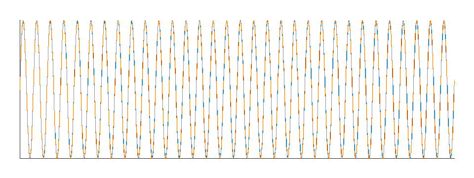
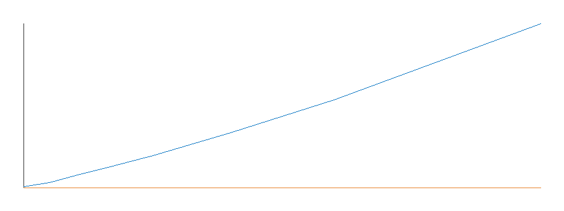

# 船舶焊接工艺大脑平台 · 风险驱动论证白皮书

定位：A02「焊接技能大师平台」想法阶段证据包 + MVP 阶段关键预研先行证据  
版本：v0.1  
日期：2026-05-30  
证据来源：260522 总体规划方案、A02 课题定义、POC 自审与评测结果

---

## 第0部分 执行摘要

本白皮书的结论是：**A02 焊接技能大师平台值得进入 MVP 阶段，但一期必须聚焦“焊接大师经验结构化与机器人复现”这一条主线，不能直接承诺完整的通用焊接工艺大脑。**

260522 总体方案提出了很完整的船舶焊接工艺大脑蓝图，覆盖工艺知识库、坡口视觉、轨迹规划、力控示教、熔池/声纹同步、AMR 自动化、焊后检测和质量闭环。这个方向有实际价值，但如果在 0->1 阶段全部并行推进，风险会被包装成“平台愿景”，难以形成可验收成果。

本阶段最关键、最能形成护城河的能力，是把技能大师的焊接手法转化为可计算、可复现、可验证的工艺包。为此，项目已完成一个最小 POC：用合成理想轨迹和真实扰动模拟，验证“轨迹 -> 结构化参数 -> 可执行轨迹”的 L1 闭环。POC 结果显示：理想轨迹往返 RMS 为 0.1643 mm，月牙、锯齿、梯形三类模板分类正确；当手抖标准差达到 0.5 mm 时，摆幅误差开始越过阈值；当手抖达到 2.0 mm 时，模板分类失败。这个结果说明 L1 可做，但也明确了失效边界。

一期建议建设边界如下：

- **做**：大师经验采集样本、结构化工艺包、摆动模板库、轨迹拟合与复现、POC 真机标定、人工确认闭环。
- **收窄做**：坡口视觉、点云处理、多层多道规划、AMR 固定工位验证，只作为支撑经验复现的输入和验证条件。
- **暂不承诺**：焊中熔池闭环自适应、完整质量反向归因、跨工位无人化 AMR 大规模调度、自动泛化到任意新坡口。

资源应优先投入在真机试验工站、技能大师样本、工艺工程师确认、机器人/力控/采集同步和评测数据闭环上。平台建设的第一性价值不是“做一个大系统”，而是让企业拥有可沉淀、可复制、可验证的焊接技能资产。

---

## 第1部分 立项论证

### 1.1 问题定义

船舶海工焊接场景存在几个长期痛点：厚板高强钢焊接依赖技能大师，复杂坡口机器人调试周期长，多源过程数据分散，工艺库缺少可复用的经验样本，质量问题往往事后才发现。260522 总体方案把这些痛点归纳为技能传承断层、机器人工艺调试低效、多源数据孤岛、专业工艺库缺失、质量管控滞后和生产模式经验依赖。

对 A02 来说，最核心的问题不是“有没有更多数据看板”，而是：

> 技能大师在焊接时的动作、节奏、角度、摆动和修正经验，如何变成机器人能复现、工艺人员能审查、企业能持续积累的工艺资产。

如果这个问题不能解决，平台最多只是把轨迹、视频、电参数和检测结果存起来；如果这个问题能解决，平台才可能从“设备集成项目”变成“焊接技能资产平台”。

### 1.2 目标定义

目标用户：

- 工艺工程师：负责定义、审核、发布工艺包。
- 机器人调试员：负责把工艺包转成机器人可执行路径并试焊。
- 技能大师/高级焊工：提供经验样本，并参与确认结构化结果是否保留真实手法。
- 质量人员：负责把试焊结果和质量评价绑定到工艺包版本。

唯一结果型目标：

> 把一条典型大师焊缝手法结构化为机器人可执行且核心特征不丢的工艺包，并通过试焊/仿真/数据回放形成可审查证据。

约束要求：

1. 必须保留原始经验样本，不能只保留优化后的轨迹。
2. 必须区分 L1 结构化、L2 条件泛化、L3 闭环自适应，分别承诺。
3. 必须人在回路，工艺包发布和标准化入库需要工艺人员确认。

### 1.3 方案描述

一期最小闭环是：

```text
典型焊缝任务
-> 大师/拖拽/机器人轨迹采集
-> 原始轨迹回放与标注
-> 提取摆动模板、摆幅、摆频、行进速度、工作角、行进角、层道信息
-> 生成结构化工艺包
-> 重组为机器人可执行轨迹
-> 仿真/试焊/质量检测
-> 工艺人员确认后版本入库
```

上线后的用户体验应是工艺人员围绕“焊缝对象”和“工艺包”工作，而不是围绕设备文件工作。操作人员选择典型焊缝，系统加载原始经验样本和结构化结果，展示轨迹、参数、模板、误差、质量结果和版本说明。工艺人员可以确认、调整或拒绝结构化结果，机器人调试员基于确认版本执行试焊。

### 1.4 风险与措施

关键风险不在于“能不能采集轨迹”，而在于“采集后能不能转成有工艺语义的结构化资产”。本白皮书采用风险登记表处理所有主要承诺：能做的继续，工程可做但需投入的列资源，需预研验证的绑定里程碑，暂不承诺的从一期移出。

措施：

- L1 经验结构化作为一期核心研发。
- L2 坡口到参数/模板映射作为探针，不作为一期验收主目标。
- L3 熔池闭环自适应冻结到后续研究阶段。
- AMR 跨工位、大构件分段、质量反向归因均收窄为路线图项。

### 1.5 资源评估

影响成败的关键资源：

- 真机试验工站：机器人、焊枪、焊接电源、基础安全环境。
- 技能大师样本：至少覆盖平焊/横焊/立焊中的典型坡口和层道。
- 采集能力：TCP 位姿、时间戳、电参数、必要时力控和视频。
- 工艺人员：定义工艺包字段、判定结构化结果是否可用。
- 质量验证：试板、焊后形貌、探伤或外观质量结果。
- 软件工程：结构化引擎、回放标注、工艺包版本管理、报告输出。

### 1.6 成果衡量

一期验收建议采用可量化指标：

| 指标 | 建议目标 | 用途 |
| --- | --- | --- |
| 典型焊缝样本数 | 不少于 10 条有效样本 | 支撑初始模板和流程验证 |
| 原始数据完整率 | >= 95% | 保证可追溯 |
| 结构化字段完整率 | >= 90% | 保证工艺包可审查 |
| 理想/标定样本轨迹往返 RMS | 目标 <= 1.0 mm | 评价复现精度 |
| 工作角/行进角偏差 | 目标 <= 2° | 评价姿态复现 |
| 摆幅/摆频误差 | 结合真机标定确定 | 评价手法特征保留 |
| 工艺包确认率 | 由工艺人员确认 | 评价业务可用性 |

若指标未达预期，优先判断是采集质量、标注不足、算法失效还是工艺包模型字段缺失，而不是简单增加模型复杂度。

### 1.7 竞品与参考

现有机器人示教、离线编程和视觉跟踪方案可提供工程组件，但通常不直接解决“技能大师经验语义化”的问题。它们更擅长完成路径生成、碰撞检查、点云识别或机器人执行。A02 的差异化应落在工艺数据结构、经验样本库、模板化手法表达和质量验证闭环上。

### 1.8 成果定义

技术成果：

- 焊接工艺包数据结构。
- 大师经验结构化引擎原型。
- 典型焊缝样本与评测报告。
- 风险登记表、路线图、验收指标。
- 后续软著/专利/数据资产基础。

经营成果：

- 焊接技能大师平台 MVP。
- 智能焊接工站增值软件模块。
- 焊接工艺服务与复用资产。
- 可用于样板项目和客户演示的证据包。

---

## 第2部分 风险登记表

标签说明：

- ✅ 已可做：当前技术或工程能力已明确。
- 🔧 工程可做需投入：路线清楚，但需要设备、集成、数据和工程工作量。
- 🔬 需预研验证：价值明确，但核心假设需实验验证。
- ⛔ 暂不承诺：当前阶段不应作为一期承诺。

| 分区 | 承诺原文/来源 | 拆解为技术命题 | 标签 | 处置 | 依据 |
| --- | --- | --- | --- | --- | --- |
| Part1 采集视觉 | §6.1 最小 10ms 时间粒度采集轨迹、力控、电参、视频、声纹 | 多源数据按统一时间轴对齐 | 🔧 | 继续 | 工程上可通过硬触发、时间戳和采集卡实现，但需设备选型和集成验证 |
| Part1 采集视觉 | §7.2 坡口类型识别与几何参数解算 | 从点云/轮廓中识别 V/X/I/K/角焊缝并提取参数 | 🔧 | 继续 | 点云滤波、RANSAC、轮廓拟合是成熟工程问题，但精度要靠试件标定 |
| Part1 采集视觉 | §16 坡口宽度/深度/间隙误差 <= ±0.5mm，角度 <= ±1° | 视觉测量指标达到验收阈值 | 🔧 | 继续 | 可作为 MVP 视觉验收指标，但需标准试件和人工复核基准 |
| Part1 采集视觉 | §7.3 手眼标定与坐标统一 | 激光、机器人、工件坐标统一 | 🔧 | 继续 | 是视觉焊接系统必需基础，需现场标定流程和误差记录 |
| Part1 采集视觉 | §7.5 三维可视化交互 | 点云回放、测量、标注、人工复核 | ✅ | 继续 | 可用现有三维可视化/点云工具实现，一期应服务经验样本复核 |
| Part2 经验结构化 | §6.3 特征提取标准化 | 提取角度、速度、干伸、摆幅、摆频、停留和参数窗口 | 🔬 | 继续 | POC 已初步验证 L1 的摆动/速度/姿态字段，真机样本需二次标定 |
| Part2 经验结构化 | §8.2 不低于 9 种摆动模板 | 平焊/立焊/横焊各配置典型模板 | 🔧 | 收窄 | POC 已验证月牙、锯齿、梯形，并注册 8 字形扩展；一期先做高频模板 |
| Part2 经验结构化 | §8.3 人工轨迹智能拟合 | 去抖动、剔除无效停顿、保留真实手法并重组轨迹 | 🔬 | 继续 | POC 已给出合成+扰动证据和失效边界；真机扰动需重新评估 |
| Part2 经验结构化 | §9.2 区分工艺停留与无意义停顿 | 停顿语义识别 | 🔬 | 收窄 | POC 只验证了无效停顿对速度估计影响，尚未识别左右工艺停留 |
| Part2 经验结构化 | §8.1 轨迹与工艺协同规划 | 坡口几何自动映射参数、层道、姿态、摆动 | 🔬 | 收窄 | 属于 L2 条件泛化，需要真实坡口与质量样本，一期只能做探针 |
| Part2 经验结构化 | §8.4 多层多道规划 | 依据填充体积自动生成层道拓扑和参数 | 🔬 | 收窄 | 需要坡口断面、熔敷效率、层间温度、质量验证；一期做规则原型 |
| Part2 经验结构化 | §8.5 仿真校核与碰撞检测 | 输出前检查可达性、干涉、奇异点、分段衔接 | 🔧 | 继续 | 工程工具成熟，但一期应围绕单工位典型焊缝 |
| Part2 经验结构化 | §9.1 阻抗控制柔性拖拽 | 通过力控让大师自然示教 | 🔧 | 继续 | 需要六维力传感器和控制器集成，不是算法文档能单独证明 |
| Part3 质量熔池 | §10.1 熔池形态智能识别 | 强弧光环境下识别熔池轮廓并提取长宽面积 | 🔬 | 冻结 | 价值高但难度大，一期只采集/回放，不承诺闭环控制 |
| Part3 质量熔池 | §10.2 声纹-视频-工艺同步 | 声纹、视频、电参、轨迹统一回放 | 🔧 | 收窄 | 同步可做，智能关联需样本；一期服务经验分析，不做质量判定主模型 |
| Part3 质量熔池 | §12.1 焊道形貌三维重建 | 焊后扫描提取余高、宽度、咬边等 | 🔧 | 继续 | 与坡口扫描类似，工程可做，但需检测基准 |
| Part3 质量熔池 | §12.3 质量闭环机制 | 缺陷反向驱动参数、层道、模板优化 | 🔬 | 收窄 | 需要缺陷样本和重复验证，一期只沉淀样本和人工规则 |
| Part3 质量熔池 | §12.3 通过熔池/声纹实时调整手法 | 焊中闭环自适应 | ⛔ | 冻结 | 属于 L3 研究级问题，不应作为一期承诺 |
| 自动化作业 | §11 AMR 跨工位、大构件分段 | 移动底座跨工位自动覆盖和分段焊接 | 🔧 | 收窄 | AMR 工程可做，但一期固定工位优先，避免移动系统吞掉主线 |
| 平台系统 | §13 平台建设内容全覆盖 | 一期同时做知识库、视觉、轨迹、力控、熔池、AMR、质量闭环 | ⛔ | 调整 | 应拆成路线图，不能作为 0->1 一次性交付范围 |

风险表结论：**一期可以承诺 L1 经验结构化闭环和真机标定，不宜承诺完整 L2 泛化和 L3 闭环自适应。**

---

## 第3部分 开源复用评估表

评估标尺：省事、绑深、可控、运维、可替代。

| 候选 | 可用位置 | 省事 | 绑深 | 可控 | 运维 | 可替代 | 结论 |
| --- | --- | --- | --- | --- | --- | --- | --- |
| rerun | 轨迹/点云/多源时间轴回放 | 高 | 低 | 中 | 中 | 高 | 分层引用：适合 POC 和采集驾驶舱验证，不作为生产数据库和控制总线 |
| Open3D/PCL | 点云滤波、配准、RANSAC | 高 | 中 | 高 | 中 | 中 | 建议引用：Part1 点云处理优先复用成熟库 |
| ROS/MoveIt | 机器人规划、碰撞检测 | 中 | 高 | 中 | 中 | 中 | 谨慎引用：若机器人生态匹配可用，否则避免一期被整套框架绑定 |
| scipy | 曲线插补、信号处理 | 高 | 低 | 高 | 低 | 高 | 继续使用：POC 已采用，缺失时有回退策略 |
| geomdl/NURBS | NURBS 插补 | 中 | 低 | 高 | 低 | 高 | 作为扩展评估，不急于引入 |
| 工业相机/点云厂商 SDK | 采集接入 | 高 | 高 | 中 | 中 | 低 | 设备到位后逐个判，接口层隔离 |
| 力控/阻抗控制库 | 柔顺拖拽 | 中 | 高 | 中 | 高 | 低 | 与硬件强相关，优先采购验证，不在白皮书中虚构算法成熟度 |

开源复用原则：**算法和可视化能复用就复用，工艺数据结构和经验模型必须自有。**

---

## 第4部分 四阶段路线图

| 阶段 | 重点问题 | 最低证据 | 技术目标 | 卡点里程碑 | Part1 状态 | Part2 状态 | Part3 状态 |
| --- | --- | --- | --- | --- | --- | --- | --- |
| 想法 | 值不值得做，边界是否清楚 | 本白皮书、风险表、POC 结果 | L1 合成+扰动验证 | 风险项分类完成 | 方案拆解 | POC 已完成 | 仅列边界 |
| MVP | 核心假设能否在半真实/真实场景成立 | 真机 Demo、试板数据、测试记录、用户反馈 | L1 真机标定 + L2 探针 | 10 条有效样本、工艺包确认、试焊记录 | 典型坡口采集 | 结构化引擎接真机 | 焊后形貌作为验证 |
| 发布 | 是否能作为产品/交付能力 | 发布版本、验收指标、交付包、运维边界 | L1 产品化，局部 L2 规则化 | 样板项目验收 | 采集工具稳定 | 工艺包版本管理 | 质量报告闭环 |
| 规模化 | 是否能跨项目复用和持续改进 | 多项目复用、客户案例、收入/价值证据 | L2 数据驱动泛化，L3 研究储备 | 跨客户样本库、标准化资产 | 多场景采集 | 经验模型迭代 | 缺陷归因模型 |

---

## 第5部分 关键预研报告

### 5.1 POC 目标

POC 验证的问题是：在没有真机样本的 0->1 阶段，能否先用合成理想轨迹和真实扰动模拟，证明 L1 经验结构化的数学闭环可行。

POC 数据流：

```text
摆动模板 + 工艺参数
-> 合成理想大师轨迹
-> 注入手抖/漂移/无效停顿
-> decompose 为 WeldProcess
-> recompose 为可执行轨迹
-> metrics 输出误差和失效边界
```

### 5.2 证据文件

- `report/data/poc_evidence.json`
- `report/data/poc_robustness.csv`
- `report/assets/poc_roundtrip.png`
- `report/assets/poc_robustness.png`
- 源 POC：`weld-experience-engine/`





### 5.3 关键指标

| 指标 | 结果 |
| --- | --- |
| 理想轨迹往返 RMS | 0.1643 mm |
| 行进速度恢复误差 | 0.0053 mm/s |
| 摆幅恢复误差 | 0.0349 mm |
| 摆频恢复误差 | 0.0012 Hz |
| 月牙/锯齿/梯形模板分类 | 全部正确 |
| 摆幅失效边界 | 0.5 mm 手抖 std |
| 摆频失效边界 | 当前扫描范围内未越界 |
| 2.0 mm 手抖下模板分类 | 失败 |

### 5.4 预研结论

POC 支持以下结论：

- L1 经验结构化不是纯概念，已经具备可运行的闭环种子。
- `model/` 工艺数据结构是长期资产，应继续沉淀。
- 摆动模板、行进速度、工作角/行进角、轨迹复现误差可以形成量化评测口径。
- 失效边界必须进入白皮书和后续验收，不能只展示最好结果。

POC 不支持以下结论：

- 不能证明真机采集一定可达到同样误差。
- 不能证明曲线焊缝、多层多道、复杂坡口均可自动结构化。
- 不能证明 L2 新坡口泛化已经可产品化。
- 不能证明 L3 熔池闭环自适应可一期交付。

---

## 第6部分 一期建设边界与立项建议

### 6.1 一期建议范围

一期目标：完成“典型焊缝大师经验采集 -> 结构化工艺包 -> 机器人复现 -> 质量验证 -> 版本入库”的 MVP。

一期建设内容：

1. 焊缝对象和工艺包数据结构。
2. 大师经验采集与原始样本归档。
3. 轨迹回放、裁剪、标注和人工确认。
4. L1 结构化引擎：摆动、速度、姿态、层道字段。
5. 机器人复现轨迹生成和仿真/试焊验证。
6. 典型坡口视觉采集作为输入，不追求全场景覆盖。
7. 焊后形貌/质量结果绑定，用于工艺包确认。
8. 风险报告和验收数据输出。

### 6.2 一期明确不做

- 不承诺完整无人化 AMR 跨工位调度。
- 不承诺任意坡口自动生成最优工艺。
- 不承诺焊中熔池闭环自适应。
- 不承诺质量缺陷自动归因模型成熟。
- 不重复建设 ERP/MES/PLM/QMS。

### 6.3 资源整合清单

| 资源 | 最小要求 | 作用 |
| --- | --- | --- |
| 机器人/焊接工站 | 一套可试焊工站 | 验证工艺包复现 |
| 技能大师 | 参与样本采集和结果确认 | 提供真实经验基准 |
| 工艺工程师 | 定义字段和验收规则 | 保证平台服务工艺而非只服务算法 |
| 质量检测 | 外观/形貌/必要探伤 | 建立验证闭环 |
| 软件工程 | POC 产品化和数据管理 | 形成可用工具 |
| 项目现场 | 典型焊缝和试板 | 形成 MVP 证据 |

### 6.4 立项建议

建议 A02 进入 MVP 阶段，但以“焊接技能大师经验结构化平台”作为一期名称和边界，暂不以“完整焊接工艺大脑平台”作为一期验收对象。

立项理由：

- 痛点真实：大师经验难传承、机器人调试依赖经验、质量追溯滞后。
- 方向有护城河：经验结构化和工艺包资产是长期价值，不是单次设备集成。
- 风险可控：POC 已证明 L1 闭环可运行，并明确了失效边界。
- 价值可落地：一期可直接服务典型焊缝复现、工艺复用、调试效率提升和样板项目展示。

下一阶段必须以真实样本和试焊验证替代概念叙事。平台价值不在于系统名词完整，而在于让企业第一次拥有可积累、可复制、可评审的焊接技能资产。
