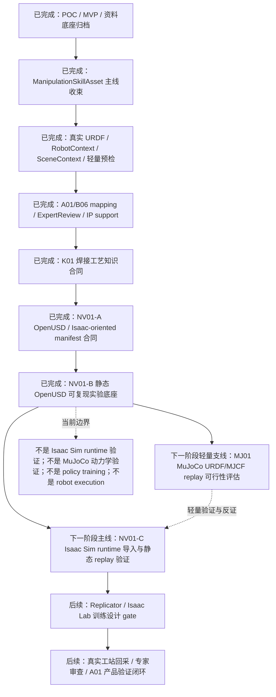

# NV01-C + MJ01 Runtime Replay Roadmap Implementation Plan

> **For agentic workers:** REQUIRED SUB-SKILL: Use superpowers:subagent-driven-development (recommended) or superpowers:executing-plans to implement this plan task-by-task. Steps use checkbox (`- [ ]`) syntax for tracking.

**Goal:** 将下一阶段路线沉淀为项目级文档指引：NV01-C 作为 Isaac Sim runtime import/static replay 主线，MJ01 作为 MuJoCo lightweight URDF/MJCF replay 可行性支线。

**Architecture:** 本轮只做文档和路线实现，不新增 Isaac Sim、MuJoCo 或 OpenUSD runtime 依赖。README 作为项目入口说明路线，details 作为阶段记录说明判断变化和验证结果，HTML 阅读副本与 Markdown 保持同步。

**Tech Stack:** Markdown, static HTML reading copies, existing `weld-experience-engine` pytest suite, `rg`.

---

## Scope Check

In scope:

- 更新 `README.md`，加入 “Isaac 重栈主线 + MuJoCo 轻量支线” 的定位、流程图、职责边界、下一阶段任务和边界。
- 同步更新 `README.html` 阅读副本。
- 更新 `details.md`，新增 2026-06-26 阶段记录，说明路线修订、下一阶段计划、边界和验证结果。
- 同步更新 `details.html` 阅读副本。
- 增加本 spec 和本 implementation plan。
- 运行文档关键字检查和默认测试。
- 通过 PR 合入远端后清理本地分支。

Out of scope:

- 不实现 Isaac Sim runtime 脚本。
- 不引入 MuJoCo 依赖。
- 不实现 MJCF converter、控制器、viewer 或训练。
- 不生成 Replicator dataset。
- 不做 Isaac Lab 或 MuJoCo policy training。
- 不声明真实 robot execution、真实 collision validation、真实焊接质量验证或正式 WPS/PQR。

## File Map

- Create: `docs/superpowers/specs/2026-06-26-nv01-c-mj01-runtime-replay-roadmap-design.md`
  - 记录头脑风暴阶段产出的路线设计、关键判断、验收门槛和风险。
- Create: `docs/superpowers/plans/2026-06-26-nv01-c-mj01-runtime-replay-roadmap.md`
  - 记录本轮文档执行计划。
- Modify: `README.md`
  - 项目入口路线说明，加入 NV01-C + MJ01 粗粒度流程图和下一阶段任务。
- Modify: `README.html`
  - `README.md` 的 HTML 阅读副本。
- Modify: `details.md`
  - 阶段记录新增 2026-06-26 说明。
- Modify: `details.html`
  - `details.md` 的 HTML 阅读副本。

No implementation code should be changed in this plan.

---

### Task 1: README Route Update

**Files:**
- Modify: `README.md`
- Modify: `README.html`

- [ ] **Step 1: Update project positioning**

In `README.md`, update the project positioning paragraph so it states:

```markdown
经过 NVIDIA 物理 AI 技术框架调研，本项目的未来重底座选型调整为：以 OpenUSD 作为数字孪生交换层，以 Isaac Sim 作为默认目标仿真运行时，以 Isaac Lab 作为后续训练闭环目标层。考虑到 Isaac / OpenUSD / Omniverse 技术栈较重，后续同步保留 MuJoCo 作为轻量、学术化、快速动力学验证和反证支线，用于 URDF/MJCF 可加载性、轨迹 replay、接触/运动学假设和小规模策略原型验证。
```

Keep the existing A02 responsibility sentence: A02 owns skill asset semantics, K01 procedure contract, evidence governance, expert review, A01/IP handoff.

- [ ] **Step 2: Add coarse roadmap flowchart**

In `README.md`, after “当前主链路”, include a `项目粗粒度路线图` section with this structure:



- [ ] **Step 3: Add layered runtime route**

Rename `NVIDIA-native 物理 AI 底座路线` to `重/轻仿真底座分层路线`.

Add MuJoCo as:

```markdown
- MuJoCo：作为轻量、学术化和快速迭代的支线，用于 URDF/MJCF 模型加载、关节/接触动力学 sanity check、TCP 轨迹 replay、简化控制原型和 Isaac 重栈前的低成本反证。MuJoCo 不承载最终工站级数字孪生表达，不替代 OpenUSD 场景合同，也不直接输出真实机器人执行结论。
```

Add the summary paragraph:

```markdown
后续路线采用“Isaac 重栈主线 + MuJoCo 轻量支线”的判断：Isaac / OpenUSD 负责工站级场景、传感器、合成数据、复杂可视化和未来 sim-to-real 主验证；MuJoCo 负责更快暴露机器人模型、轨迹、接触和控制假设中的问题。两条路线都必须消费同一个 `ManipulationSkillAsset`、`RobotContextSpec`、`SceneContextAsset` 和 K01 工艺知识合同，并把验证结果写回 evidence / blocking report，避免形成新的平行资产体系。
```

- [ ] **Step 4: Update next-stage tasks and boundaries**

Replace the “下一阶段任务” list with:

```markdown
下一阶段建议以 NV01-C Isaac Sim Runtime Import and Static Replay Validation 为主线，同时启动 MJ01 MuJoCo Lightweight Replay Feasibility 作为轻量支线。任务粒度保持在 runtime / replay gate，不进入训练或真机执行：

1. 准备并记录 Isaac Sim runtime 环境、版本、启动方式和失败边界。
2. 导入 NV01-B `openusd_stage.usda` 与 replay fixture，验证 `/World`、robot、workpiece、weld task、seam path、TCP trajectory candidate、sensor placeholder 和 safety boundary prim 可加载。
3. 做静态或低速 trajectory replay，输出 runtime validation report，明确 stage import、frame binding、trajectory binding、procedure metadata 和 sensor placeholder 的通过/阻塞项。
4. 并行做 MJ01：从当前真实 URDF / nominal robot context 生成或校验 MuJoCo 可消费的 URDF/MJCF 最小模型，验证关节、mesh、TCP frame、简化工件/焊缝和 TCP 轨迹 replay 是否可运行。
5. 自动汇总仍阻塞真实 replay 的输入：robot USD/articulation、MJCF/URDF 模型质量、TCP/tool/workpiece 标定、最小 sensor layout、H300 工站日志、电流/电压/热输入、工艺人员确认和专家审查结论。
6. 继续把 Isaac Lab policy training、Replicator dataset、MuJoCo 策略训练、真实碰撞验证、真实焊接质量验证和 robot execution 留到后续 evidence gate。
```

In “边界”, include:

```markdown
- 当前确认 OpenUSD / Isaac Sim / Isaac Lab 是未来真实仿真训练闭环的主底座方向，MuJoCo 是轻量验证和反证支线；NV01-B 已写出静态 `openusd_stage.usda` 原型和 validation gate，但仍是 `not_isaac_sim_runtime_validation` 和 `not_mujoco_dynamics_validation`，不宣称已经完成 Isaac Sim runtime replay、MuJoCo 动力学验证、Isaac Lab 训练或真实 sim-to-real 验证。
```

- [ ] **Step 5: Sync README.html**

Update `README.html` to match `README.md` using the existing static HTML style. Do not introduce a new renderer, JavaScript, Mermaid runtime, or CSS redesign.

- [ ] **Step 6: Verify README route**

Run:

```bash
rg -n "项目粗粒度路线图|重/轻仿真底座分层路线|MuJoCo|MJ01|not_isaac_sim_runtime_validation|not_mujoco_dynamics_validation|not_ready_for_robot_execution" README.md README.html
```

Expected:

- Both `README.md` and `README.html` contain the route, MuJoCo支线, MJ01, `not_isaac_sim_runtime_validation`, `not_mujoco_dynamics_validation`, and `not_ready_for_robot_execution`.

---

### Task 2: Details Stage Record

**Files:**
- Modify: `details.md`
- Modify: `details.html`

- [ ] **Step 1: Add 2026-06-26 stage entry**

In `details.md`, add a new `### 2026-06-26` entry near the top of the “阶段记录” / dated updates section.

The entry must state:

```markdown
### 2026-06-26

- 根据当前项目状态和同事讨论，后续路线修订为“Isaac 重栈主线 + MuJoCo 轻量支线”。
- Isaac / OpenUSD / Isaac Lab 继续作为工站级数字孪生、传感器、合成数据和未来训练闭环主线；MuJoCo 作为轻量、学术化、快速动力学验证和反证支线。
- 下一阶段建议以 NV01-C Isaac Sim Runtime Import and Static Replay Validation 为主线，同时启动 MJ01 MuJoCo Lightweight Replay Feasibility。
- NV01-C 只验证 NV01-B `openusd_stage.usda` 和 replay fixture 能否在真实 Isaac Sim runtime 中导入、绑定和静态/低速 replay，不进入 policy training 或 robot execution。
- MJ01 只验证当前真实 URDF / nominal robot context 能否形成 MuJoCo 可消费的 URDF/MJCF 最小模型，并做 TCP trajectory candidate replay，不替代 OpenUSD 场景合同。
- README 已新增项目粗粒度路线图和重/轻仿真底座分层路线；本阶段仍保留 `not_isaac_sim_runtime_validation`、`not_mujoco_dynamics_validation`、`not_ready_for_robot_execution`、`not_formal_WPS_PQR` 和 `not_real_welding_quality_validation` 边界。
```

If there is a “下一阶段计划” section that still only mentions NV01-C, update it to mention MJ01 as the lightweight branch too.

- [ ] **Step 2: Sync details.html**

Update `details.html` with the same dated entry and wording. Keep the current static HTML style. Do not add new CSS or JavaScript.

- [ ] **Step 3: Verify details route**

Run:

```bash
rg -n "2026-06-26|Isaac 重栈主线|MuJoCo 轻量支线|MJ01|not_isaac_sim_runtime_validation|not_mujoco_dynamics_validation|not_ready_for_robot_execution" details.md details.html
```

Expected:

- Both Markdown and HTML contain the dated record, MJ01, and required boundary tokens.

---

### Task 3: Final Verification, PR, Merge, Cleanup

**Files:**
- Verify all modified files from Task 1 and Task 2.

- [ ] **Step 1: Run documentation keyword checks**

Run:

```bash
rg -n "MuJoCo|MJ01|NV01-C|重/轻仿真底座分层路线|not_isaac_sim_runtime_validation|not_mujoco_dynamics_validation|not_ready_for_robot_execution" README.md README.html details.md details.html docs/superpowers/specs/2026-06-26-nv01-c-mj01-runtime-replay-roadmap-design.md docs/superpowers/plans/2026-06-26-nv01-c-mj01-runtime-replay-roadmap.md
```

Expected:

- All six files contain the expected route or boundary language where appropriate, including `not_ready_for_robot_execution`.

- [ ] **Step 2: Run default tests**

Run:

```bash
cd weld-experience-engine
uv run pytest -q
```

Expected:

- All tests pass. At the time this plan was written, the expected count is `433 passed`.

- [ ] **Step 3: Review diff**

Run:

```bash
git diff --stat
git diff -- README.md README.html details.md details.html docs/superpowers/specs/2026-06-26-nv01-c-mj01-runtime-replay-roadmap-design.md docs/superpowers/plans/2026-06-26-nv01-c-mj01-runtime-replay-roadmap.md
```

Expected:

- Only documentation/spec/plan files are changed.
- No implementation code changed.

- [ ] **Step 4: Commit**

Run:

```bash
git add README.md README.html details.md details.html docs/superpowers/specs/2026-06-26-nv01-c-mj01-runtime-replay-roadmap-design.md docs/superpowers/plans/2026-06-26-nv01-c-mj01-runtime-replay-roadmap.md
git commit -m "docs: plan nv01-c and mujoco replay roadmap"
```

- [ ] **Step 5: Push and create PR**

Run:

```bash
git push -u origin codex/nv01-c-mj01-roadmap
gh pr create \
  --title "docs: plan NV01-C and MuJoCo replay roadmap" \
  --body "$(cat <<'EOF'
## Summary
- add NV01-C + MJ01 runtime/replay roadmap spec and implementation plan
- update README with Isaac重栈主线 + MuJoCo轻量支线路线图
- update details and HTML reading copies with the next-stage direction and boundaries

## Test Plan
- rg keyword checks for NV01-C/MJ01/MuJoCo boundary language
- cd weld-experience-engine && uv run pytest -q
EOF
)"
```

- [ ] **Step 6: Merge PR remotely**

After PR checks are acceptable, merge via GitHub CLI:

```bash
gh pr merge --merge --delete-branch
```

If the repository requires squash or rebase merge, use the available repo policy instead. Do not force merge over failing checks.

- [ ] **Step 7: Clean local branch**

Run:

```bash
git switch main
git pull --ff-only
git branch -d codex/nv01-c-mj01-roadmap
```

Expected:

- Local `main` contains the merged work.
- Local feature branch is deleted.
- Working tree is clean.
